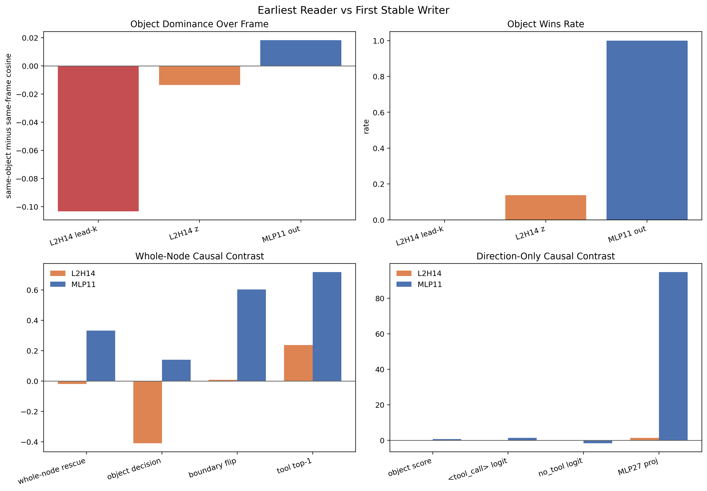
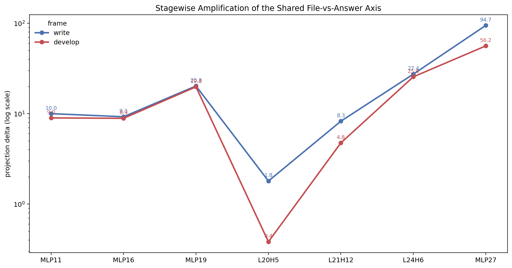
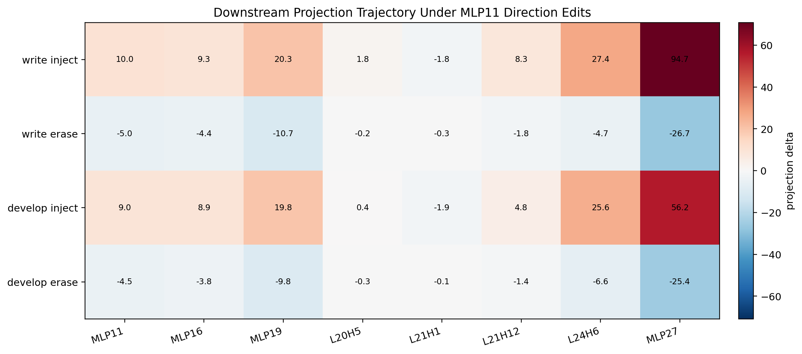
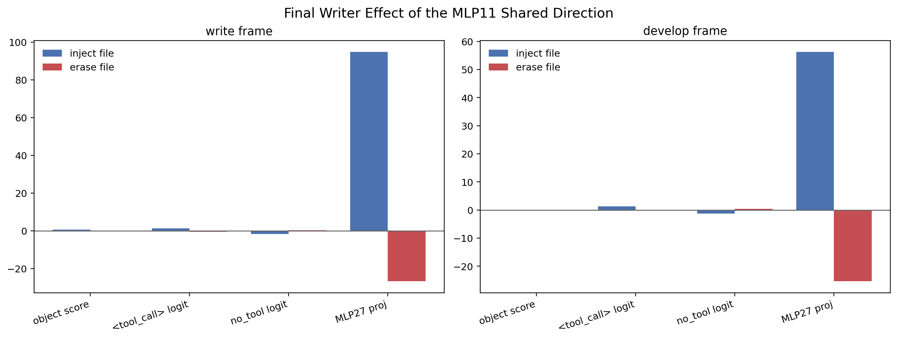
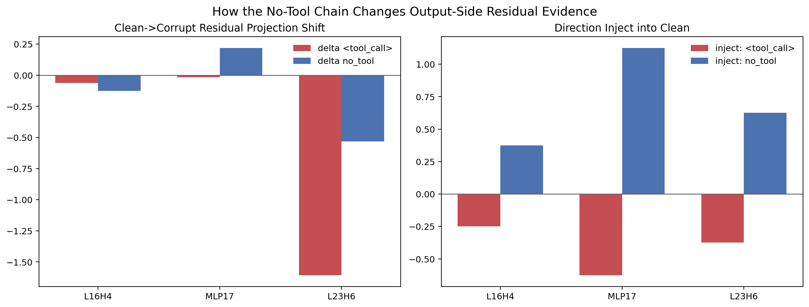
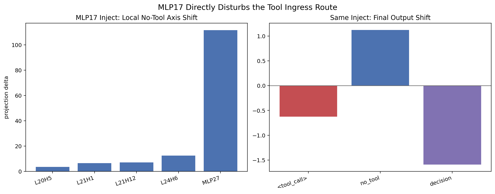
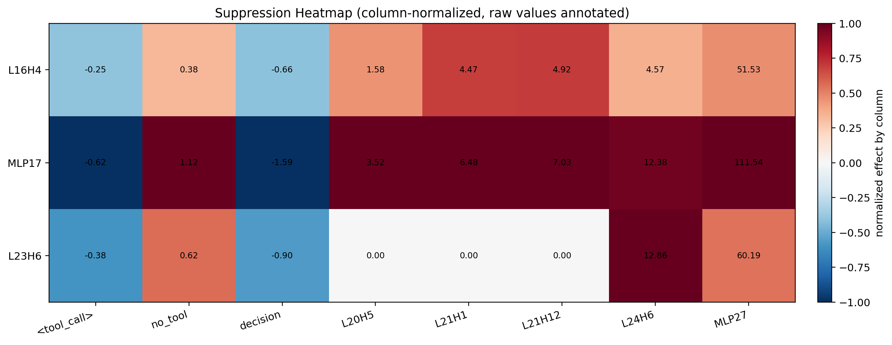
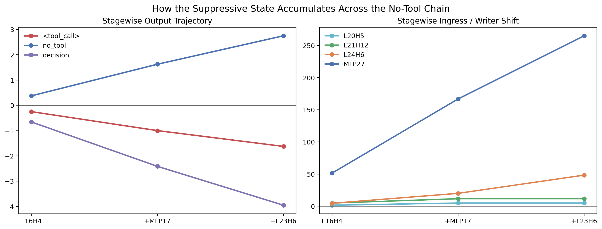

# Tool-Call（工具调用）决策电路机制总文档

## 1. 范围与核心结论

本文档只做一件事：

解释在当前已发现的带符号电路（signed circuit）内，最小 cue 为什么会引发级联变化，并最终把首个生成位置从 `<tool_call>` 翻到 `no_tool`，或者反过来翻回 `<tool_call>`。

本文档不再重复电路定位过程，也不再把主要篇幅花在正确性验证（correctness）上。这里的重点只有两个：

1. 电路内部有哪些模块分工。
2. 每个模块对什么对象做了什么操作。

当前最适合写进论文主文的机制主线，不应写成“某条轴被放大”，而应写成下面四个模块协同工作：

1. **开头要求读取模块** `L2H14`  
   它读取 instruction 开头那一小段要求语块，区分这次请求更像是在要求“把结果交付到外部文件”，还是“直接在当前回答里给出结果”。
2. **交付方式写入模块** `MLP11 -> MLP16 -> MLP19`  
   它把开头那一小段要求，写成后续层可以持续使用的交付方式状态：偏向“外部文件交付”，或者偏向“直接文本回答”。
3. **tool-call 组装模块** `L20H5 -> L21H12 -> L24H6 -> MLP27`  
   它把“外部文件交付”状态与 file target、function body、tool 协议前缀结合起来，最终把首 token 写向 `<tool_call>`。
4. **普通回答抑制模块** `L16H4 -> MLP17 -> L23H6`  
   它读取 task body 里的常规回答线索，把它写成 `no_tool` 一侧的状态，同时压住晚层 tool 路。

因此，这条机制链最简洁的写法是：

> 最小 cue 先改变开头要求读取模块 `L2H14` 读到的开头要求；随后 `MLP11 -> MLP16 -> MLP19` 把这份差异写成可持续的交付方式状态；如果该状态偏向“外部文件交付”，晚层 tool-call 组装模块就会把 file target、function body 和 tool 协议前缀拼起来，并由 `MLP27` 写出 `<tool_call>`；如果该状态偏向“直接文本回答”，普通回答抑制模块就会写强 `no_tool`，同时压住 tool 路。

---

## 2. 任务与最小干预接口

我们的 clean / corrupt 样本对只改变 instruction 开头的一个 token 或极小 lead phrase。

- clean：首个生成位置偏向 `<tool_call>`
- corrupt：首个生成位置偏向 `no_tool`

这不是为了再证明“第一个词很重要”，而是为了给出一个最小干预接口：

> 只改开头极小的一段要求，最终决策就会翻转。

因此我们真正要解释的是：

1. 为什么这段开头要求会被模型读成两种不同的交付方式？
2. 为什么“外部文件交付”会进入 `<tool_call>` 路，而“直接文本回答”会进入 `no_tool` 路？
3. 为什么 `no_tool` 路不只是单独写 `no_tool`，还会反过来压 tool 路？

---

## 3. 当前正式电路与模块划分

图 01 给出当前最终带符号电路（signed circuit）。

**图 01 的作用**

- 它说明当前结果不是零散节点，而是一张稀疏的带符号电路。
- 它也是后文所有模块分工的结构底图。

当前论文主线只需要两条链、四个模块：

### 前向主链

`L2H14 -> MLP11 -> MLP16 -> MLP19 -> L20H5 -> L21H12 -> L24H6 -> MLP27`

### 抑制主链

`L16H4 -> MLP17 -> L23H6`

表 1 用模块语言总结整条链。

| 模块 | 组件 | 主要对象操作 | 最终作用 |
|---|---|---|---|
| 开头要求读取模块 | `L2H14` | 读取 instruction opening 中的要求语块 | 决定后续是更像“外部文件交付”，还是“直接文本回答” |
| 交付方式写入模块 | `MLP11 -> MLP16 -> MLP19` | 把开头要求写成持久的交付方式状态 | 为晚层提供稳定的“该如何交付答案”信号 |
| tool-call 组装模块 | `L20H5 -> L21H12 -> L24H6 -> MLP27` | 读取 file target / function body / tool 协议前缀，并把它们拼起来 | 把首 token 写向 `<tool_call>` |
| 普通回答抑制模块 | `L16H4 -> MLP17 -> L23H6` | 读取常规文本回答线索，写强 `no_tool`，同时压 tool 路 | 把首 token 推向 `no_tool` 并干扰 tool 写出 |

---

## 4. 指标与公式

下面这些指标只用于**测量证据**。它们不是本文的机制名称。

### 4.1 Decision Score（决策分数）

定义：

`DecisionScore = Score_tool - Score_no_tool`

解释：

- `Score_tool`：当前条件下对 tool endpoint 的目标分数
- `Score_no_tool`：当前条件下对 no-tool endpoint 的目标分数

含义：

- `DecisionScore > 0`：更偏向 `<tool_call>`
- `DecisionScore < 0`：更偏向 `no_tool`

### 4.2 Delivery Score（交付方式分数）

历史数据文件里沿用的是 `ObjectScore` 这个字段名，但它测量的其实是“外部文件交付”与“直接文本回答”之间的差异。本文把它解释为交付方式分数。

定义：

`ObjectScore = Score_file - Score_answer`

含义：

- `ObjectScore > 0`：更偏向外部文件交付（external-file delivery）
- `ObjectScore < 0`：更偏向直接在当前回答中给出文本结果（inline-answer delivery）

### 4.3 Rescue Ratio（恢复比例）

定义：

`RescueRatio = (Score_patched - Score_base) / (Score_anchor - Score_base)`

解释：

- `Score_base`：基础条件下分数
- `Score_anchor`：目标 anchor 条件下分数
- `Score_patched`：干预后分数

含义：

- `1`：完全恢复到 anchor
- `0`：没有恢复
- `< 0`：干预方向与目标方向相反

### 4.4 Mediation（中介量）

定义：

`Mediation(A -> B) = Rescue(source-only) - Rescue(source-with-B-blocked)`

含义：

- 如果只 patch `A` 时恢复明显
- 但把 `B` 挡住后恢复显著下降
- 说明 `A` 的一部分效应是经由 `B` 实现的

### 4.5 Projection Delta（投影变化量）

对节点表示 `h` 和目标方向 `d`，定义：

`ProjectionDelta = <h_after - h_before, d_unit>`

其中 `d_unit` 是单位化后的目标方向。

含义：

- `> 0`：沿该方向正向移动
- `< 0`：沿该方向反向移动

在本文里，`ProjectionDelta` 只是证据读数，用来证明某个模块确实把表示推向了某一侧；它本身不是机制叙事。

---

## 5. 模块一：开头要求读取模块 `L2H14`

这一步要回答的问题是：

> 最小 cue 为什么不是“什么都没发生”，而是能在极早层被读到？

当前最强的结论是：

- `L2H14` 是最早保留下来的头级读取节点。
- 它读的不是孤立词面，而是 instruction opening 一侧的要求语块。
- 这份读入仍然以“开头框架”差异为主，尚未稳定写成后续层可复用的交付方式状态。

图 18 把 `L2H14` 和 `MLP11` 放在一起看。

**图 18 的核心信息**

- `L2H14` 已经读到了开头要求差异。
- 但 `L2H14` 还没有把这份差异写成稳定的“外部文件交付 / 直接文本回答”状态。
- 同样的开头框架变化，在 `MLP11` 才第一次变成稳定写出。

表 2 总结这一层的读入与输出。

| 组件 | 读什么 | 输出什么 | 最关键证据 |
|---|---|---|---|
| `L2H14` | instruction opening 一侧的要求语块；更像是在读“开头要求怎么说” | 送入 `MLP11` 的小幅开头差异 | 同对象跨框架（same-object cross-frame）`0.897` < 同框架跨对象（same-frame cross-object）`1.000`；只改它的写出方向时，`write_answer` 上交付方式分数只变 `+0.0022` |
| `MLP11` | `L2H14` 上游传来的开头要求状态 | 第一条稳定的交付方式状态 | 同对象跨框架 `0.992` > 同框架跨对象 `0.974`；whole-node patch 下 `write` frame file-rescue `0.332`，object-decision `0.141` |

因此，这一模块最适合写成：

> `L2H14` 先把开头要求读进来，但它还只是“开头要求读取器”，不是决定最终交付方式的稳定写出器。

---

## 6. 模块二：交付方式写入模块 `MLP11 -> MLP16 -> MLP19`

这一步要回答的问题是：

> 开头那一小段要求，在哪里第一次变成了后续层真正可用的“交付方式状态”？

当前最强的结论是：

- `MLP11` 是第一个稳定写出“外部文件交付 / 直接文本回答”差异的节点。
- `MLP16` 与 `MLP19` 负责保持并放大这份状态。
- 到 `MLP19` 为止，这份状态已经足够稳定，晚层 tool-call 组装模块可以直接读取它。

图 19 展示这份状态如何逐层增强。

**图 19 的核心信息**

- 开头要求差异在 `L2H14` 处很弱。
- 到 `MLP11` 才第一次变成稳定的交付方式状态。
- `MLP16` 与 `MLP19` 继续保持并强化它，而不是各自另起一条新故事。

图 20 与图 21 给出这里最硬的因果证据。

**图 20 与图 21 的核心信息**

- 只改 `MLP11` 的交付方式方向，就会把下游节点整体推向“外部文件交付”一侧。
- 这种变化会一直传到 `MLP27`，并改变 `<tool_call>` 与 `no_tool` 的末端 logit。

表 3 总结这里最重要的数。

| 干预 | 交付方式分数变化 | `tool logit` 变化 | `no_tool` / distractor 变化 | 关键下游变化 |
|---|---:|---:|---:|---|
| `L2H14` write inject | `+0.0022` | `0.0` | `0.0` | `MLP27 +1.44` |
| `MLP11` write inject | `+0.678` | `+1.375` | `-1.625` | `MLP16 +9.26`，`MLP19 +20.26`，`L21H12 +8.26`，`L24H6 +27.38`，`MLP27 +94.68` |
| `MLP11` write erase | `-0.189` | `-0.500` | `+0.375` | `MLP16 -4.43`，`MLP19 -10.65`，`L21H12 -1.84`，`L24H6 -4.70`，`MLP27 -26.74` |

这些数支撑的不是“有一条轴”，而是更具体的一句话：

> `MLP11` 把“这次该把结果交付到外部文件，还是直接在回答里给出文本”写成了稳定状态；`MLP16` 与 `MLP19` 让这份状态持续存在，直到晚层模块可以直接使用它。

---

## 7. 模块三：tool-call 组装模块 `L20H5 -> L21H12 -> L24H6 -> MLP27`

这一步要回答的问题是：

> 一旦交付方式状态已经偏向“外部文件交付”，模型是怎样把它真正写成 `<tool_call>` 的？

当前最强的对象操作分工如下。

| 节点 | 主要对象操作 | 当前最强证据 |
|---|---|---|
| `L20H5` | 读取 file target / function body 一侧对象，把“要往外部文件交付”的状态接到具体文件与代码对象上 | 在 head span / causal span 审计里，最强读入落在 `file_target` 与 `function_body_anchor` 一侧；在 `MLP11` 注入后，它的下游投影随之上升 |
| `L21H12` | 把 instruction tail / tool 协议前缀与上游状态合并，形成更像 `<tool_call>` 前缀的表示 | `MLP11` 注入后 `L21H12 +8.26`；晚层桥接里它是最稳定的路由节点 |
| `L24H6` | 把已经偏向 tool 的状态送到输出附近 | `MLP11` 注入后 `L24H6 +27.38`；它位于最终写出前一跳 |
| `MLP27` | 把这份状态真正写成 `<tool_call>` 一侧的 logit 倾向 | `MLP11` 注入后 `MLP27 +94.68`；最终 `<tool_call>` 变化最大 |

这条模块链最适合写成：

> `L20H5` 先把“外部文件交付”状态接到具体 file target 与 function body；`L21H12` 再把它与 tool 协议前缀拼起来；`L24H6` 把这份已经组装好的状态送到输出附近；最后 `MLP27` 把首 token 写向 `<tool_call>`。

因此，这一段不是“晚层又出现一条新语义轴”，而是：

> 晚层在把已经写好的交付方式状态，落实成具体的 tool-call 前缀。

---

## 8. 模块四：普通回答抑制模块 `L16H4 -> MLP17 -> L23H6`

这一步要回答的问题是：

> 为什么 `no_tool` 路不只是被动出现，而是会主动压 tool 路？

当前最强的结论是：

- `L16H4` 读取 task body / tail-suffix 一带的常规文本回答线索。
- `MLP17` 把这份线索写成真正有 token 后果的 `no_tool` 状态。
- 这份状态既抬高 `no_tool`，也压低 `<tool_call>`。
- `MLP17` 还会把晚层 tool 路整体往 no-tool 一侧推。
- `L23H6` 再把这份已经写好的状态送到输出附近。

图 22 先回答“它到底是抬高 `no_tool`，还是压低 `<tool_call>`？”

**图 22 的核心信息**

- 抑制链不是单侧作用。
- 尤其在 `MLP17`，两件事同时发生：
  - `<tool_call>` 下降
  - `no_tool` 上升

表 4 总结抑制模块的分工。

| 节点 | 读什么 | 写什么 | 最关键证据 |
|---|---|---|---|
| `L16H4` | task body / tail-suffix 一带的常规文本回答线索 | 送入 `MLP17` 的抑制性头输出 | task-body span rescue `0.022`；`z` rescue `0.198`；inject 到 clean 后 tool `-0.25`、no-tool `+0.375` |
| `MLP17` | 来自 `L16H4` 的常规文本回答状态 | 偏向 `no_tool` 的抑制状态，同时压低 `<tool_call>` | projection delta：tool `-0.016`、no-tool `+0.219`；inject：tool `-0.625`、no-tool `+1.125`；decision `-1.592` |
| `L23H6` | 已经写好的抑制状态 | 把它送到输出附近 | inject：tool `-0.375`、no-tool `+0.625`；`z` rescue `0.280` |

这里最关键的结论是：

> `MLP17` 不是单纯“多写了一个 `no_tool` token”，而是把普通文本回答状态写强，同时把 `<tool_call>` 一侧压低。

---

## 9. `no_tool` 路如何压 tool 路

图 23 直接看 `MLP17` 是否只改末端，还是也改了晚层 tool 路本身。

**图 23 的核心信息**

- `MLP17` 并不是只在最后一步写 `no_tool`。
- 它会把 `L20H5`、`L21H1`、`L21H12`、`L24H6`、`MLP27` 一起推向各自更偏 no-tool 的局部状态。

关键数如下：

| 节点 | `MLP17` 注入后投影变化 |
|---|---:|
| `L20H5` | `+3.52` |
| `L21H1` | `+6.48` |
| `L21H12` | `+7.03` |
| `L24H6` | `+12.38` |
| `MLP27` | `+111.54` |

因此，这条抑制链最适合写成：

> `MLP17` 一边把 `no_tool` 一侧写强，一边把晚层 tool-call 组装模块整体往 no-tool 一侧推。

这就是为什么 `no_tool` 链不是“另一条平行输出链”，而是竞争性的抑制链。

---

## 10. 抑制状态的逐层积累

图 24 和图 25 把抑制链收束成一条完整叙事。

**图 24 的核心信息**

- `L16H4`、`MLP17`、`L23H6` 对 output 与晚层 tool 路的作用是有结构的，而不是随机扰动。

**图 25 的核心信息**

- 抑制状态不是在单个节点突然出现，而是沿链条逐步累积。

表 5 给出最核心的逐阶段数字。

| stage | 节点集合 | `tool token` 变化 | `no_tool token` 变化 | `DecisionScoreDelta` | `no_tool_top1_rate` |
|---|---|---:|---:|---:|---:|
| 1 | `L16H4` | `-0.25` | `+0.375` | `-0.657` | `0.012` |
| 2 | `L16H4 | MLP17` | `-1.00` | `+1.625` | `-2.414` | `0.289` |
| 3 | `L16H4 | MLP17 | L23H6` | `-1.625` | `+2.750` | `-3.951` | `0.783` |

这张表支撑的不是“又一条方向被放大”，而是更容易写进论文的一句话：

> `L16H4` 先把普通文本回答线索读进来；`MLP17` 把它写成真正会改变 token 的 `no_tool` 状态；`L23H6` 再把这份状态送到输出附近，使它真正参与首 token 决策。

---

## 11. 从最小 cue 到最终首 token：整条链如何闭环

现在可以把整条链收束成一段真正面向论文正文的叙事。

当 instruction opening 更像是在要求“把结果交付到外部文件”时，`L2H14` 会先把这份开头要求读进来；随后 `MLP11` 会把它写成稳定的交付方式状态，`MLP16` 与 `MLP19` 让这份状态持续存在。晚层里，`L20H5` 会把这份状态接到具体的 file target 与 function body 上，`L21H12` 会把它与 tool 协议前缀结合，`L24H6` 把它送到输出附近，最后 `MLP27` 把首 token 写向 `<tool_call>`。

当 instruction opening 更像是在要求“直接在当前回答中给出结果”时，前向 tool 模块得不到同样强的“外部文件交付”状态；与此同时，`L16H4` 会从 task body / tail-suffix 一带读到普通文本回答线索，`MLP17` 把这份线索写成 `no_tool` 状态，并同时压低 `<tool_call>` 一侧，还把晚层 tool-call 组装模块整体往 no-tool 一侧推；`L23H6` 再把这份状态送到输出附近。于是首 token 会翻到 `no_tool` 一侧。

因此，这个任务最核心的机制不是“某条抽象轴被放大”，而是：

> **开头要求被读成两种不同的交付方式；其中一种会触发 tool-call 组装，另一种会触发普通文本回答，并竞争性压制 tool-call。**

---

## 12. 正式主张边界

为了让主线收束，当前最适合写进论文的 strongest claims 是：

1. `L2H14` 是最早保留下来的开头要求读取节点。
2. `MLP11` 是第一个稳定写出“交付方式状态”的节点。
3. `MLP16 -> MLP19` 负责保持并放大这份交付方式状态。
4. `L20H5 -> L21H12 -> L24H6 -> MLP27` 负责把“外部文件交付”状态组装成 `<tool_call>` 前缀。
5. `L16H4 -> MLP17 -> L23H6` 负责把普通文本回答线索写成 `no_tool` 状态，并竞争性压制 tool 路。
6. `MLP17` 同时抬高 `no_tool`，压低 `<tool_call>`，并扰动晚层 tool-call 组装模块。

当前不应作为 strongest claim 的内容：

- `L2H14` 最窄微特征的唯一命名
- `L16H4` 最窄微特征的唯一命名
- `L21H1` 是否应被升级成与 `L21H12` 同等级的 headline 模块

---

## 13. 当前建议引用的正式文件

正文优先引用：

- [图索引](../figures/FIGURE_INDEX.csv)
- [数据索引](../data/DATA_INDEX.csv)
- [paper-facing focused evidence table（面向论文主线的证据表）](../data/paper_facing_focused_evidence_table.csv)
- [paper-facing claim tiers（面向论文主线的主张分层）](../data/paper_facing_claim_tiers.json)
- [suppression focused evidence table（抑制链证据表）](../data/suppression_focused_evidence_table.csv)
- [suppression claim tiers（抑制链主张分层）](../data/suppression_claim_tiers.json)

历史旧文档已归档到：

- `../archive/docs_legacy/`

---

## 14. 一句话总结

当前这套结果最合适的论文写法不是“最小 cue 激活了一条抽象方向”，而是：

> 最小 cue 先被 `L2H14` 读成两类不同的开头要求；`MLP11 -> MLP16 -> MLP19` 再把它写成稳定的交付方式状态；如果这份状态偏向“外部文件交付”，`L20H5 -> L21H12 -> L24H6 -> MLP27` 就会把 file target、function body 和 tool 协议前缀组装成 `<tool_call>`；如果它偏向“直接文本回答”，`L16H4 -> MLP17 -> L23H6` 就会把普通文本回答状态写强，并压住 tool 路，最终把首 token 推向 `no_tool`。
