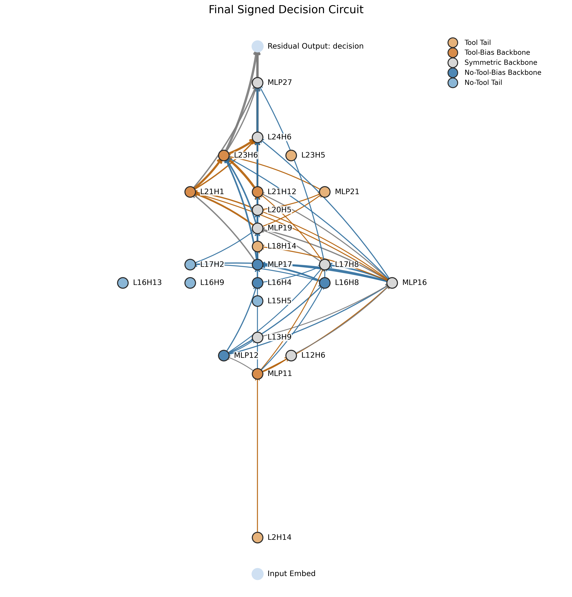
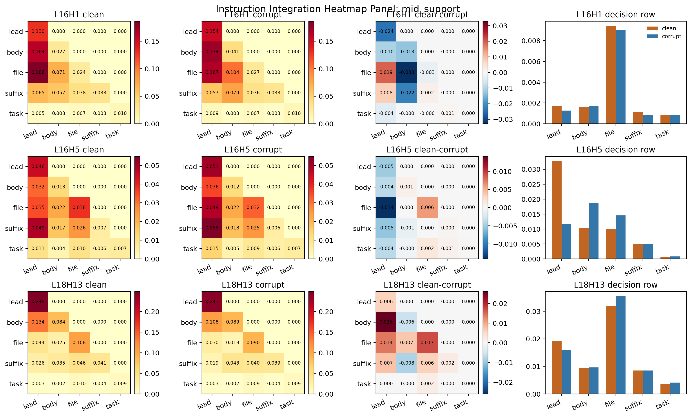
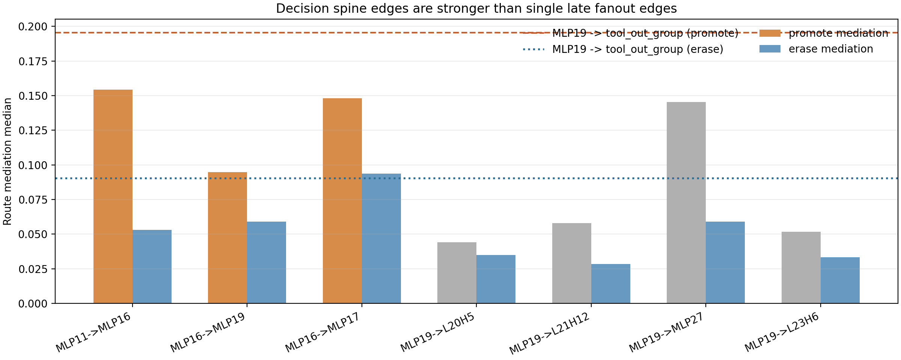
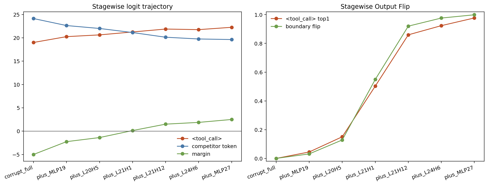
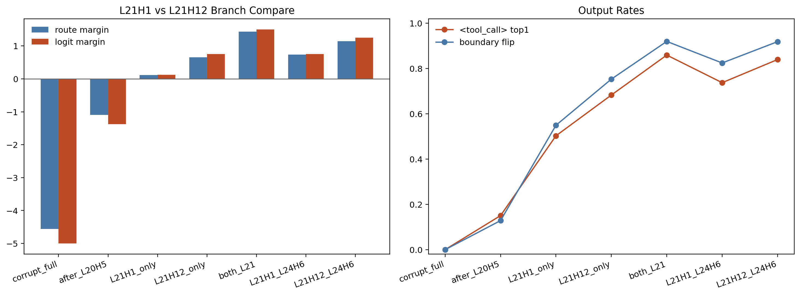
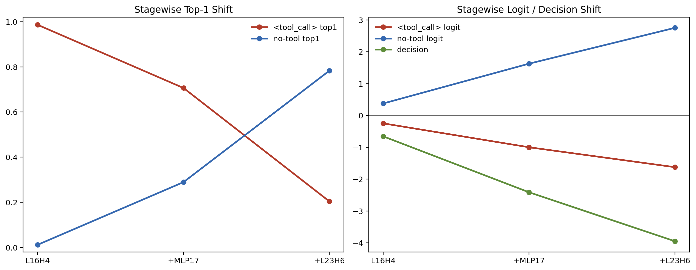
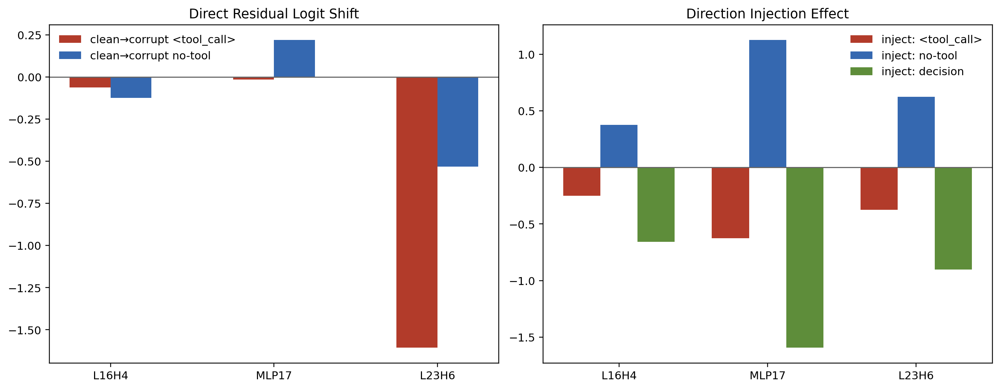
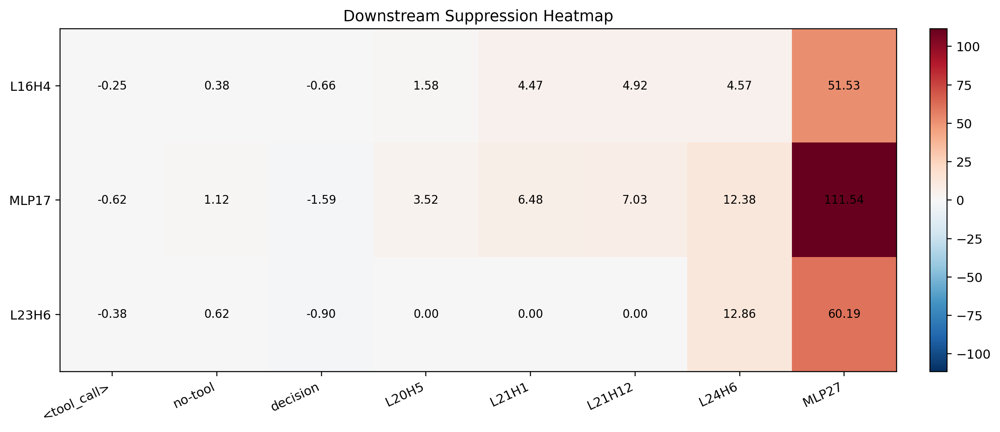

# 工具调用决策机制：四个模块如何连成一条线

## 0. 这份文档要解决什么问题

这份文档只想回答一个问题：

> 为什么只改 `prompt` 开头一个很短的词组，模型首个输出词就会在 `<tool_call>` 和普通回答之间翻转？

我们现在已经把项目里的结果收束成四个模块：

1. `Instruction Integration`
2. `Output-Route Decision`
3. `Tool-Call Construction`
4. `Tool-Call Suppression`

这四个模块不是四个零散发现，而是一条连续机制线上的四个阶段。

为了让整篇文档更好读，本文只保留少数必要的英文记号：

- 模块名：`Instruction Integration`、`Output-Route Decision`、`Tool-Call Construction`、`Tool-Call Suppression`
- 节点名：如 `L2H14`、`MLP11`
- 关键符号：`<tool_call>`、`route score`、`prompt`、`clean`

除这些之外，尽量都用中文来讲。

---

## 1. 先给一句话总答案

当前最可信的总机制是：

> 模型先把开头要求、函数体、文件名和后续说明整合起来，再把它们压成一个稳定的输出路线状态；如果这份状态偏向工具路线，后面的节点就会把 `<tool_call>` 逐步组装出来；如果这份状态偏向直接回答路线，另一条抑制链就会把 `no_tool` 写强，并主动压住工具路线。

这条总线可以写成：

$$
(\text{L2H14} + \text{L11H5} \rightarrow \text{MLP11})
\rightarrow
(\text{MLP11} \rightarrow \text{MLP16} \rightarrow \text{MLP19})
$$

然后分成两条后路：

$$
\text{工具路线： }
\text{MLP19} \rightarrow \text{L20H5} \rightarrow (\text{L21H1} / \text{L21H12}) \rightarrow \text{L24H6} \rightarrow \text{MLP27}
$$

$$
\text{直接回答路线： }
\text{MLP16} \rightarrow \text{MLP17}
\quad\text{并由}\quad
\text{L16H4} \rightarrow \text{MLP17} \rightarrow \text{L23H6}
\text{构成主抑制链}
$$

读这篇文档时，可以一直带着下面这个问题往下走：

> 前一个模块到底把什么交给了后一个模块？

只要这个问题一直清楚，整条线就不会散。

---

## 2. 为什么我们相信这条总线是真的

在进入四个模块之前，先把整条线最关键的背景说明清楚。

### 2.1 这不是普通对比，而是最小干预

我们的数据是 `1722` 对 `clean / corrupt` 样本。

这批数据最重要的特点是：

- 每对样本尽量只改 `prompt` 开头一个动词或一个很短的词组
- `clean` 的首词偏向 `<tool_call>`
- `corrupt` 的首词偏向普通回答一侧
- 其余主体内容尽量保持不变

这意味着：

> 我们不是在研究“整段提示词风格变了”，而是在研究“一个极小的开头线索，怎样一路影响到首词决策”。

### 2.2 这不是只找正向链，而是同时找正向和反向

如果只把 `<tool_call>` 当目标，通常更容易找到促进工具调用的那条线，但很难把真正的抑制链找完整。

本项目用了双向反转：

- 一次把工具侧当 `clean`，去找促进 `<tool_call>` 的链
- 一次把工具侧反过来当 `corrupt`，去找压住 `<tool_call>`、推动普通回答的链

所以最后得到的不是单边电路，而是一条共享主干加两条竞争分支的机制。

### 2.3 这条总线已经有整体电路作为背景

这两张图在这里的作用只有一个：

> 它们说明我们不是凭直觉随便分四块，而是在一张已经通过充分性和必要性验证的总电路上，把真正能讲清楚人类可理解机制的那几段主链重新组织出来。

当前保留的正式总电路规模是：

- `24` 个节点
- `64` 条边

但这篇文档不按“24 个节点分别是什么”来讲，而是按“这 24 个节点里最核心的机制阶段是什么”来讲。

---

## 3. 四个模块怎样接起来

先把接口讲清楚，再进入每一节。

### 3.1 三个最关键的接口节点

- `MLP11`：模块 1 的出口，也是模块 2 的入口
- `MLP16`：模块 2 的中段，也是直接回答分支的分叉点
- `MLP19`：模块 2 的末端，也是工具路线进入模块 3 的接口

### 3.2 一张总表

| 模块 | 最小主链 | 它要解决的问题 | 它交给下一个模块什么 |
| --- | --- | --- | --- |
| `Instruction Integration` | `L2H14 + L11H5 -> MLP11` | 模型怎么把分散在不同位置的信息整合成一份“这次到底要什么样答案”的内部状态 | 交给 `MLP11` 上稳定可写的整合状态 |
| `Output-Route Decision` | `MLP11 -> MLP16 -> MLP19` | 模型怎么把整合状态压成“走工具路线还是走直接回答路线”的稳定偏好 | 交给工具侧一份 `route score`，同时从 `MLP16` 分出直接回答分支 |
| `Tool-Call Construction` | `MLP19 -> L20H5 -> (L21H1/L21H12) -> L24H6 -> MLP27` | 模型怎么把工具路线真正落实成 `<tool_call>` 首词 | 把 `<tool_call>` 偏好写到输出附近 |
| `Tool-Call Suppression` | `L16H4 -> MLP17 -> L23H6` | 模型怎么把普通回答状态写强，并反过来压住工具路线 | 把 `no_tool` 一侧送到输出附近，并干扰工具构造链 |

如果你把这张表记住，后面的四节就会顺很多。

---

## 4. 模块 1：Instruction Integration

### 4.1 这一节要证明什么

这一节要证明的是：

> 模型在真正做路线决定之前，确实先把开头要求、函数体、文件名和后续说明整合成了一份统一状态。

换句话说，这一节不是在证明“模型已经决定要不要调用工具”，而是在证明：

> 模型已经先把题读成了某一种“交付要求”。

### 4.2 一句话结论

当前最可信的结论是：

> `L2H14` 是最早的入口头，`L11H5` 是进入 `MLP11` 的主同层交接头，二者组成了一个两段式前端入口；到 `MLP11` 时，这份整合后的状态第一次变得稳定、可写、可继续传下去。

### 4.3 最小主链

$$
\text{L2H14} + \text{L11H5} \rightarrow \text{MLP11}
$$

其中：

- `L2H14`：最早入口
- `L11H5`：进入 `MLP11` 的主交接头
- `MLP11`：模块 1 的出口，也是模块 2 的入口

### 4.4 为什么必须有这个模块

如果没有这个模块，后面的 `Output-Route Decision` 就会变成一个没有输入来源的黑箱。

模块 2 之所以能在 `MLP11 -> MLP16 -> MLP19` 上形成稳定的 `route score`，前提是：

> 前面已经有一份被整理好的“这次到底在要求什么样输出”的状态，被稳定地送进了 `MLP11`。

所以模块 1 的作用不是可有可无的读题前奏，而是整个机制的输入端。

这里要特别说明一件事：

> 当前我们说“统一状态”，主要是在描述一种机制层面的整合结果，而不是说模块 1 已经像模块 2 那样，找到了一个被严格公式化、可单独测量的显式标量对象。

对模块 1 来说，现在最稳的证据是：

- 哪些头在反复把开头要求和别的信息绑在一起
- 哪些头把这份状态交给 `MLP11`
- 哪些中层头继续把这份状态保留到 decision spine 之前

也就是说，模块 1 当前更稳的理解是：

> 分散信息先被收拢、重绑、交接，然后在 `MLP11` 处第一次变成稳定可写的输入状态。

### 4.5 三条最关键的证据

#### 证据 1：`L2H14` 是最早还保留下来的有效入口

`L2H14` 的证据最重要的不是“它很早”，而是“它早而且还有因果作用”：

- 它的最佳因果读取位置就是开头短词组
- 它对 `MLP11` 的 target-mediated 仍为正
- 但对更晚的 `MLP16`、`MLP19` 不成立

这说明它最像真正的前端入口，而不是后面主链的弱回声。

#### 证据 2：`L11H5` 的主要交接目标就是 `MLP11`

`L11H5` 的 strongest handoff 目标不是更晚层，而就是 `MLP11` 本身：

- source-only 时，`MLP11_local_rescue = 0.197`
- 同时只有 `MLP16_local_rescue = 0.053`
- `MLP19_local_rescue = 0.028`

更关键的是：

- block `MLP11` 会把这份 `MLP11` 本地 rescue 基本擦掉
- block `MLP16` 或 `MLP19`，并不会擦掉 `MLP11` 本地 rescue

所以这条证据支持的不是“`L11H5` 也有点相关”，而是：

> `L11H5` 的主要直接交接目标就是 `MLP11`。

#### 证据 3：开头要求、函数体、文件名和后续说明不是各自孤立存在，而是在进入 `MLP11` 前被反复保留和重绑

图 4 这次真正要说明的，不是 `L2H14 + L11H5` 的联合 `patch`，而是下面这件事：

> 模型并不是只在某一个早层头里短暂看到开头短词组，然后马上结束；相反，和开头要求相关的那份信息会在进入 `MLP11` 前被多层头继续保留和重绑。

最关键的几个现象是：

- `L13H9` 更偏文件名一侧，但仍保留 `function body -> 开头短词组` 的绑定
- `L16H1` 是中层最强的用户侧绑定头之一，`bind_to_lead = 0.420`
- `L18H13` 到了决策前夕，仍然在 `decision-row` 上显著落在用户侧信息上

这说明：

> 开头要求、函数体、文件名和后续说明，并不是几个互不相干的局部片段；在进入 `MLP11` 之前，它们已经在一组头里被反复绑成同一份用户侧信息包。

在这个基础上，再看联合 `patch` 的结果：

- 相对最佳单头，`MLP11_local_rescue` 中位增益 `+0.044`
- 相对最佳单头，模块平均 rescue 中位增益 `+0.012`

但在 `route_rescue` 上没有形成很强的超加和。

所以最稳的说法不是“这两个头构成了一个神奇的强协同对子”，而是：

> `L2H14` 负责最早入口，`L11H5` 负责进入 `MLP11` 的主交接，二者共同组成了最小的两段式前端入口。

### 4.6 这一模块交给下一个模块什么

这个模块最终交给模块 2 的，是：

> `MLP11` 上一份稳定、可写、已经整合过的指令状态。

所以下一节真正要证明的，就不再是“模型有没有把题读懂”，而是：

> 这份整合状态如何在中间层被压成稳定的输出路线偏好。

---

## 5. 模块 2：Output-Route Decision

### 5.1 这一节要证明什么

这一节要证明的是：

> 模型在中间层确实形成了一份稳定的输出路线状态，而且这份状态会继续传给后面的两条竞争分支。

它要回答的不是“最后哪个词赢了”，而是：

> 在首词真正写出来之前，模型内部有没有先做一次更上层的路线决定。

### 5.2 一句话结论

当前最可信的结论是：

> `MLP11 -> MLP16 -> MLP19` 构成了最可信的决策主干；它们共同实现的是一个逐层重编码的 `route score`，表示当前状态更偏工具路线还是更偏直接回答路线。

### 5.3 最小主链

$$
\text{MLP11} \rightarrow \text{MLP16} \rightarrow \text{MLP19}
$$

并且：

$$
\text{MLP16} \rightarrow \text{MLP17}
$$

是 direct-answer 分支的强分叉边。

### 5.4 为什么必须有这个模块

如果没有这个模块，前面的整合状态就无法解释后面为什么会稳定分成两条不同的实现路线。

模块 3 和模块 4 的存在本身就说明：

> 在进入晚层之前，模型内部必须已经形成了一份更偏工具、或更偏直接回答的稳定状态。

模块 2 就是在负责这件事。

### 5.5 三条最关键的证据

#### 证据 1：三个锚点节点上的 `route score` 都稳定分开

`MLP11`、`MLP16`、`MLP19` 三个节点上，`clean / corrupt` 的 `route score` 都稳定分开：

| 节点 | clean 中位数 | corrupt 中位数 | AUC | 与最终路线分数的相关性 |
| --- | ---: | ---: | ---: | ---: |
| `MLP11` | `1.042` | `-1.014` | `0.967` | `0.770` |
| `MLP16` | `0.969` | `-0.997` | `0.996` | `0.852` |
| `MLP19` | `0.896` | `-1.024` | `0.994` | `0.862` |

这说明：

- `MLP11` 已经开始稳定写出路线状态
- `MLP16` 和 `MLP19` 把这份状态进一步放大和稳定

#### 证据 2：这不是固定向量搬运，而是逐层重编码

三个锚点之间的方向余弦几乎不共线：

- `MLP11` 和 `MLP16`：`0.041`
- `MLP11` 和 `MLP19`：`0.051`
- `MLP16` 和 `MLP19`：`-0.005`

所以当前最稳的写法不是：

> 一条固定向量从 `MLP11` 原样搬到了 `MLP19`

而是：

> 三个节点都在实现同一个同号的路线对象，但这个对象在不同层里被重新编码了。

这点很关键，因为它决定了模块 2 的本质是“逐层重编码的连续状态”，而不是“固定方向一路传递”。

#### 证据 3：`MLP11 -> MLP16 -> MLP19` 真的会传，并且 `MLP16 -> MLP17` 真的会分叉

最关键的三条强边是：

| 边 | promote 路线中介量 | erase 路线中介量 |
| --- | ---: | ---: |
| `MLP11 -> MLP16` | `0.154` | `0.053` |
| `MLP16 -> MLP19` | `0.095` | `0.059` |
| `MLP16 -> MLP17` | `0.148` | `0.094` |

这说明三件事：

1. `MLP11` 写出的状态确实传给了 `MLP16`
2. `MLP16` 的状态确实传给了 `MLP19`
3. `MLP16` 还会把 direct-answer 一侧正式分给 `MLP17`

也就是说，模块 2 不只是“能被描述出来”，而是确实在因果上把路线状态往后送。

### 5.6 这一模块交给下一个模块什么

模块 2 会把状态分成两路：

- `MLP19` 把工具侧路线状态交给模块 3
- `MLP16 -> MLP17` 把直接回答分支交给模块 4

所以到这里，整条机制线第一次真正分叉。

下一节要证明的是：

> 如果工具路线占优，模型后面到底怎样一步步把 `<tool_call>` 组装出来。

---

## 6. 模块 3：Tool-Call Construction

### 6.1 这一节要证明什么

这一节要证明的是：

> 模块 2 已经决定走工具路线之后，模型如何把这份抽象路线状态落实成首词 `<tool_call>`。

换句话说，模块 3 要回答的不是“要不要用工具”，而是：

> 既然已经走工具路线了，后面这些节点究竟怎样把 `<tool_call>` 真的写出来。

### 6.2 一句话结论

当前最可信的结论是：

> `MLP19` 先把工具侧状态扇出到构造区，`L20H5` 把它绑定到文件名和函数体对象，`L21H1` 与 `L21H12` 负责两条不同的晚层路由，`L24H6` 把状态压进协议格式，最后由 `MLP27` 把 `<tool_call>` 真正写强。

### 6.3 最小主链

$$
\text{MLP19} \rightarrow \text{L20H5} \rightarrow (\text{L21H1} / \text{L21H12}) \rightarrow \text{L24H6} \rightarrow \text{MLP27}
$$

### 6.4 为什么必须有这个模块

如果没有这个模块，我们最多只能说：

> 模型在中间层更偏工具路线。

但这还解释不了：

> 为什么最终首词真的是 `<tool_call>`，而不是别的工具相关词、普通文本前缀，或者某个半成形状态。

模块 3 的作用，就是把抽象路线偏好真正落实成具体的输出起始格式。

### 6.5 三条最关键的证据

#### 证据 1：`<tool_call>` 是逐步成形的，不是一步突然跳出来的

修正汇总 bug 之后，最关键的 `stagewise` 数字是：

| 阶段 | 路线分数 | `logit margin` | `<tool_call>` top1 |
| --- | ---: | ---: | ---: |
| `plus_MLP19` | `-1.924` | `-2.250` | `0.045` |
| `plus_L20H5` | `-1.099` | `-1.375` | `0.150` |
| `plus_L21H1` | `0.117` | `0.125` | `0.503` |
| `plus_L21H12` | `1.431` | `1.500` | `0.859` |
| `plus_L24H6` | `1.747` | `1.875` | `0.923` |
| `plus_MLP27` | `2.301` | `2.500` | `0.977` |

这说明：

- `L20H5` 之后，`<tool_call>` 还没真正过边界
- `L21H1` 之后，`<tool_call>` 首次过半
- 真正把 `<tool_call>` 写稳的是 `L21H12 / L24H6 / MLP27`

所以模块 3 的正确叙事是：

> 它不是某个单点瞬间决定的，而是一条逐步成形的构造链。

#### 证据 2：`L21H1` 和 `L21H12` 功能不同，不是简单冗余

固定 `MLP19 + L20H5` 之后：

- 只加 `L21H1`：`<tool_call>` top1 `0.503`
- 只加 `L21H12`：`<tool_call>` top1 `0.683`

再加上 `L24H6`：

- `L21H1` 分支：top1 `0.738`
- `L21H12` 分支：top1 `0.840`

这说明：

- `L21H1` 不是噪音，它确实能把 `<tool_call>` 推过边界
- 但 `L21H12` 更稳、更强，也更像真正的协议重路由头

所以当前最稳的写法是：

> `L21H1` 和 `L21H12` 是两条不同的晚层路由，其中 `L21H12` 是更强的锚点，`L21H1` 是支持性支路。

#### 证据 3：`MLP27` 是主写出器，而 `MLP19 -> MLP27` 不是独立 bypass

两件事要同时成立：

第一，`MLP27` 是主写出器。  
第二，`MLP19 -> MLP27` 还不能写成独立 bypass。

支持这两点的关键结果是：

- `MLP27` 的 clean 直接写出 margin `10.852`
- `MLP19 + MLP27` 的 shortcut top1 只有 `0.690`
- 但完整链能到 `0.977`

这说明：

- `MLP27` 确实是最后把 `<tool_call>` 写强的主节点
- 但 `MLP19 -> MLP27` 还不足以绕开 `L20H5 / L21H12 / L24H6` 这些中间步骤

### 6.6 这一模块交给下一个模块什么

模块 3 不再把状态交给“下一个模块”，它直接在输出附近写 `<tool_call>`。

但这条链并不是孤立存在的，因为模块 4 会反向压它。

所以读完这一节以后，真正要进入下一节的问题是：

> 如果直接回答路线占优，模型又是怎样反过来压住这条构造链的？

---

## 7. 模块 4：Tool-Call Suppression

### 7.1 这一节要证明什么

这一节要证明的是：

> 直接回答一侧并不是“没有走工具”这么简单，而是存在一条会主动写强 `no_tool`、并主动压制工具构造链的竞争性抑制路线。

### 7.2 一句话结论

当前最可信的结论是：

> `L16H4` 负责读 ordinary-answer 一侧的证据，`MLP17` 负责把这份状态写成同时抬高 `no_tool`、压低 `<tool_call>` 的主抑制方向，`L23H6` 再把这份抑制状态送到输出附近。

### 7.3 最小主链

$$
\text{L16H4} \rightarrow \text{MLP17} \rightarrow \text{L23H6}
$$

并且它和模块 2 的连接边是：

$$
\text{MLP16} \rightarrow \text{MLP17}
$$

### 7.4 为什么必须有这个模块

如果没有这个模块，我们只能说：

> 模型没有把 `<tool_call>` 组装出来。

但这还不足以解释：

> 为什么普通回答一侧会被明显写强，而且为什么工具构造链会被系统性压回去。

模块 4 的作用就是说明：

> 直接回答路线不是被动缺席工具调用，而是一条主动竞争、主动抑制的实现链。

### 7.5 三条最关键的证据

#### 证据 1：真正出现词元级后果的是 `MLP17`，不是 `L16H4`

最关键的 `stagewise` 数字是：

| 阶段 | `<tool_call>` 变化 | `no_tool` 变化 | 决策分数变化 | `no_tool` top1 |
| --- | ---: | ---: | ---: | ---: |
| `L16H4` | `-0.25` | `+0.375` | `-0.657` | `0.012` |
| `L16H4 + MLP17` | `-1.00` | `+1.625` | `-2.414` | `0.289` |
| `L16H4 + MLP17 + L23H6` | `-1.625` | `+2.750` | `-3.951` | `0.783` |

这说明：

- `L16H4` 时，读入已经发生，但真正的词元级后果还很弱
- 加入 `MLP17` 后，抑制效果第一次明显出现
- 加入 `L23H6` 后，这份状态被送到输出附近，大量样本真正翻向 `no_tool`

#### 证据 2：`MLP17` 同时在做两件事

`MLP17` 最关键的一点，不是“它也会抬高 `no_tool`”，而是：

> 它会同时抬高 `no_tool` 并压低 `<tool_call>`。

最直接的干预结果是：

- `L16H4` 注入：`<tool_call> -0.250`，`no_tool +0.375`
- `MLP17` 注入：`<tool_call> -0.625`，`no_tool +1.125`
- `L23H6` 注入：`<tool_call> -0.375`，`no_tool +0.625`

所以模块 4 里最硬的单点结论是：

> `MLP17` 是主抑制写出器。

#### 证据 3：`MLP17` 会反向压 construction 区

`MLP17` 的注入不只是改 final token，它还会把工具构造链一整串节点一起推向 no-tool 一侧：

| 被扰动节点 | 投影变化 |
| --- | ---: |
| `L20H5` | `+3.517` |
| `L21H1` | `+6.479` |
| `L21H12` | `+7.030` |
| `L24H6` | `+12.384` |
| `MLP27` | `+111.543` |

这正是为什么这个模块要叫 `Tool-Call Suppression`，而不只是“no-tool 写出”。

### 7.6 这一模块交给整体故事什么

模块 4 的作用，是把整条总线真正补完整。

如果没有它，整篇工作仍然会像一条单边的“工具调用构造链”。  
有了它，读者才能真正理解：

> 最终首词不是“工具链自己写出来”的，而是工具构造链和抑制链竞争之后的结果。

---

## 8. 四个模块为什么能够连成一条线

现在把四段拼回一条完整故事：

1. `Instruction Integration`  
   模型先把开头要求、函数体、文件名和后续说明整合成一份统一状态。

2. `Output-Route Decision`  
   这份整合状态在 `MLP11 -> MLP16 -> MLP19` 上被压成稳定的 `route score`，表示更偏工具路线还是更偏直接回答路线。

3. `Tool-Call Construction`  
   如果工具路线占优，`MLP19` 就把状态扇出到构造区，后面的节点把 `<tool_call>` 一步步组装出来。

4. `Tool-Call Suppression`  
   如果直接回答路线占优，`L16H4 -> MLP17 -> L23H6` 就会把 `no_tool` 写强，并反过来压制工具构造链。

最关键的不是这四句话本身，而是它们之间的接口是清楚的：

- 模块 1 把状态交给 `MLP11`
- 模块 2 把状态在 `MLP16` 分叉，在 `MLP19` 交给工具侧
- 模块 3 在输出附近写 `<tool_call>`
- 模块 4 在输出附近写 `no_tool`，同时压工具侧

所以这不是四块拼图勉强贴在一起，而是一条共享主干、后面分成两条竞争分支的机制。

---

## 9. 现在可以强写什么，不能强写什么

### 9.1 可以强写的结论

| 结论 | 当前状态 |
| --- | --- |
| 最小开头线索足以翻转首词决策 | 可以强写 |
| `L2H14` 是最早保留下来的头级入口 | 可以强写 |
| `L11H5` 是进入 `MLP11` 的主同层交接头 | 可以强写 |
| `MLP11` 是模块 1 的出口，也是模块 2 的入口 | 可以强写 |
| `MLP11 -> MLP16 -> MLP19` 是最可信的决策主干 | 可以强写 |
| `MLP16 -> MLP17` 是强分叉边 | 可以强写 |
| `L20H5 -> (L21H1/L21H12) -> L24H6 -> MLP27` 是工具构造主线 | 可以强写 |
| `MLP27` 是主写出器 | 可以强写 |
| `L16H4 -> MLP17 -> L23H6` 是主抑制链 | 可以强写 |
| `MLP17` 同时抬高 `no_tool` 并压低 `<tool_call>` | 可以强写 |

### 9.2 还要收着写的结论

| 结论 | 当前状态 |
| --- | --- |
| `L2H14` 读到的精确微特征名称 | 不能强写 |
| `L16H4` 读到的精确微特征名称 | 不能强写 |
| `L2H15` 已经可以升格为锚点 | 不能强写 |
| `L16H5` 已经可以升格为锚点 | 不能强写 |
| `L21H1` 和 `L21H12` 完全同级 | 不能强写 |
| `MLP19 -> MLP27` 已经是独立 bypass | 不能强写 |
| `route score` 是跨层固定向量 | 必须回收 |

---

## 10. 如果只记一句话

请记这一句：

> 这项工作的核心不是“模型里有一条抽象轴被放大”，而是“最小开头线索先改变输出路线状态；如果工具路线占优，模型就把 `<tool_call>` 组装出来；如果直接回答路线占优，另一条抑制链就会把 `no_tool` 写强并压住工具路线”。  

这句话就是整篇文档真正要证明的主线。
