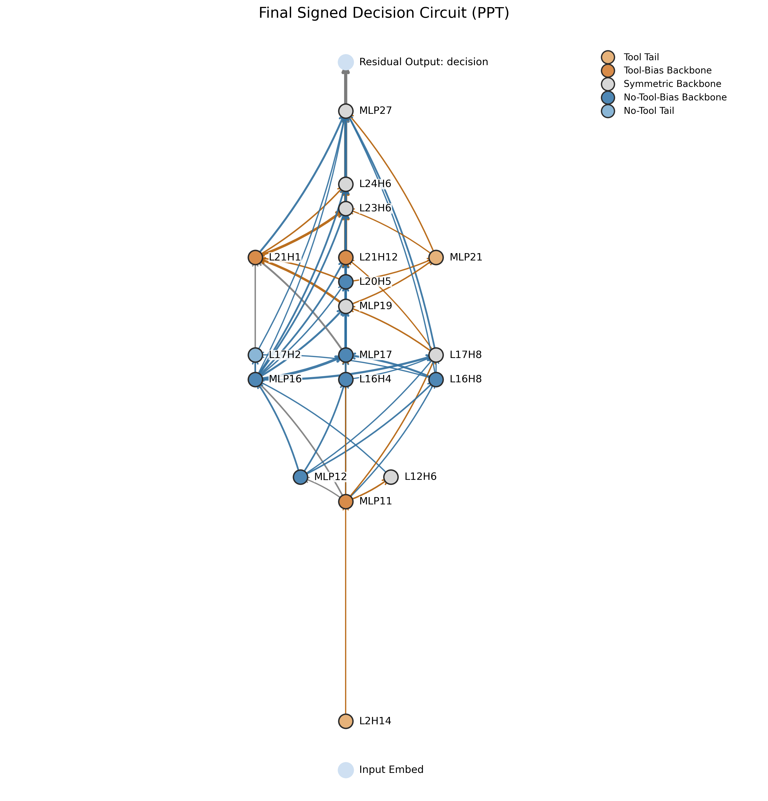
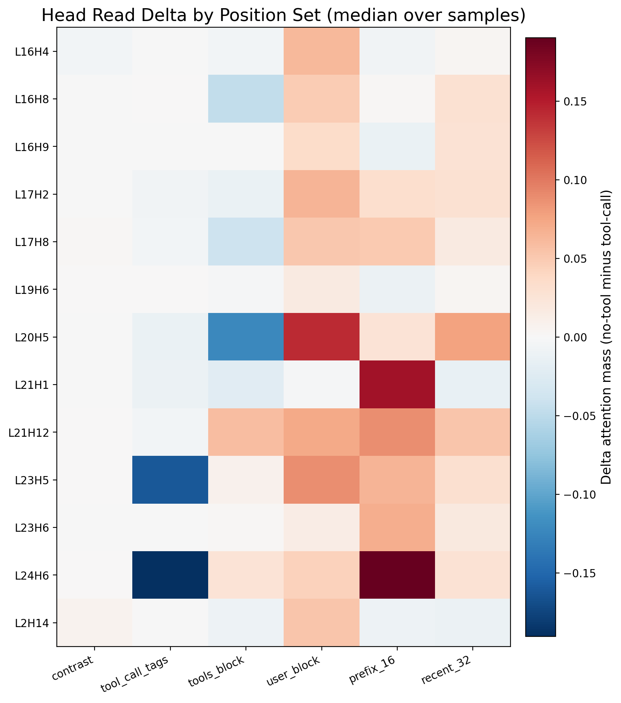
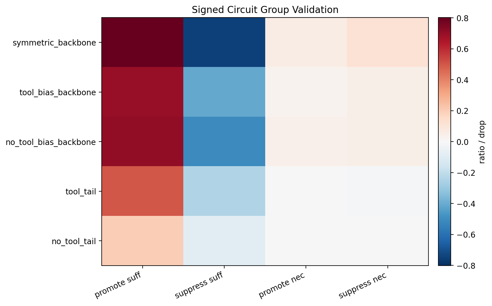
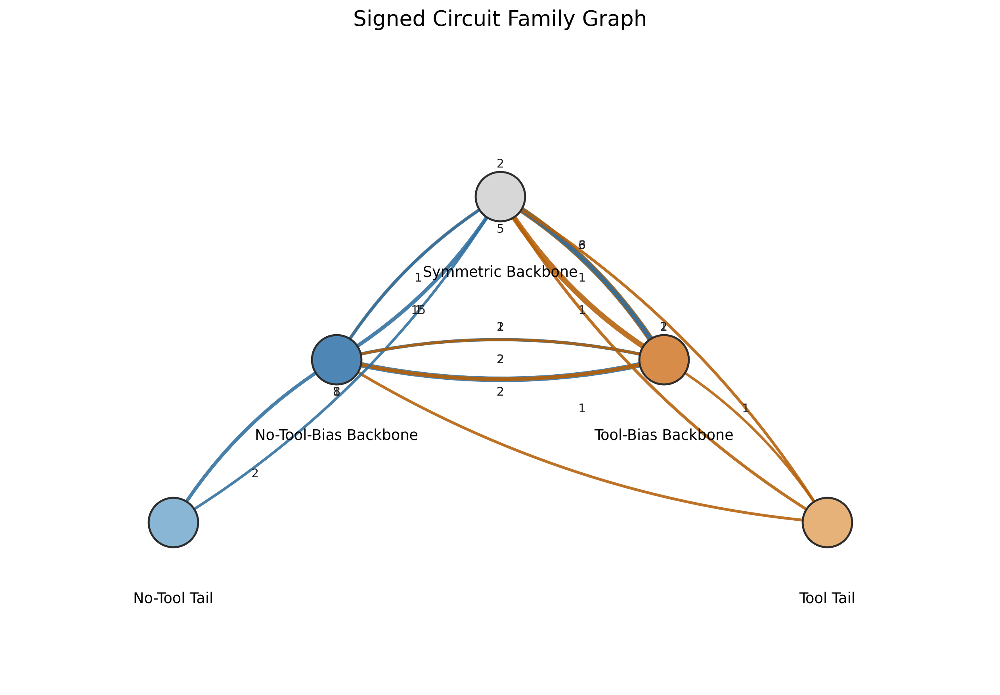
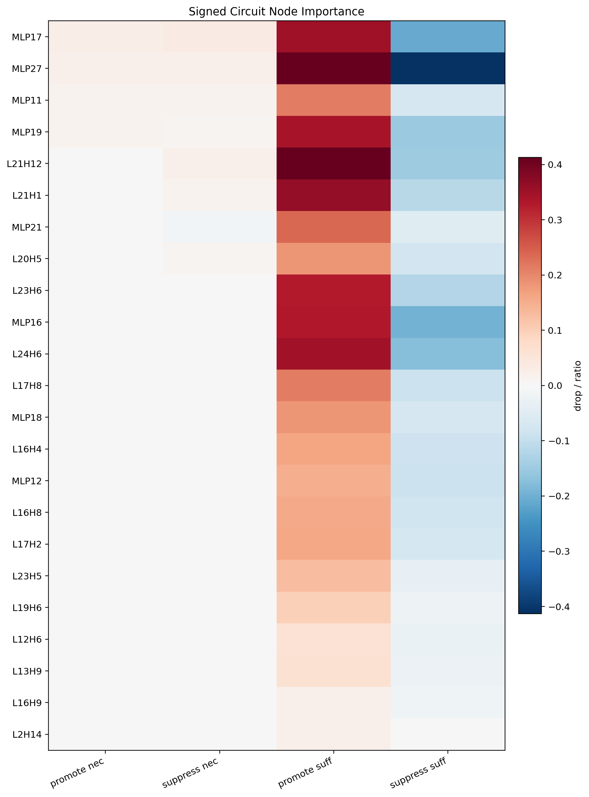
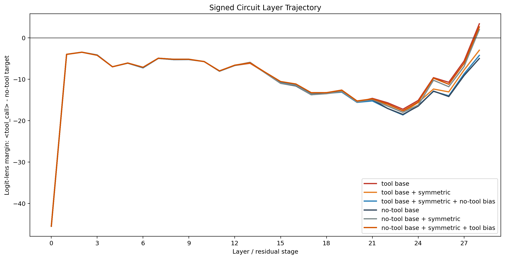

# Tool-Use Signed Circuit Storyline

This markdown is a slide-by-slide bilingual draft for the PPT.  
中文负责把逻辑讲清楚，英文可以直接抽到幻灯片上。

---

## Slide 1. The Circuit We Found | 我们找到的电路

**CN**  
我们最后要讲的对象，不是“一堆指标”，而是一张 faithful 的 `signed decision circuit`：它解释模型在首个生成位置到底是输出 `<tool_call>`，还是停留在 no-tool 模式。  
主图的核心结论是：这不是两套彼此独立的 promote / suppress 电路，而是一个**共享主干**，上面叠加了朝两个端点倾斜的**方向性偏置**。

**EN**  
The final object is not a collection of metrics, but a faithful `signed decision circuit` that explains whether the model emits `<tool_call>` at the first generation step or stays in the no-tool mode.  
The key result is that this is not two separate promote/suppress circuits, but a **shared backbone** with **directional biases** written on top of it.

### What Is the Backbone? | 怎么理解 backbone？

**CN**  
这里的 `backbone` 不是“看起来居中”的节点，而是满足两个条件的共享子系统：  
1. 它在 tool 方向和 no-tool 方向都稳定出现；  
2. 它单独 patch 进去，就已经足以把首 token 决策翻到对侧端点。  
所以它的含义是：**这是模型在这个二元决策里真正共用的可翻转主机制**。

**EN**  
Here, the `backbone` does not mean “nodes drawn in the middle.” It means a shared subsystem that satisfies two conditions:  
1. it appears stably in both the tool and no-tool directions;  
2. patching it alone is already sufficient to flip the first-token decision toward the opposite endpoint.  
So the backbone is the **shared reversible mechanism** of this binary decision.

### How to Read This Circuit | 如何阅读这张电路图

**CN**  
这张图可以用一个人类可读的决策流程来理解：

1. `Reader heads` 先读输入中的关键信号，例如 `user block`、`tools schema`、`tool-call tags`。  
2. `Router heads` 把这些信息往后层搬运、重组、对齐到决策位置。  
3. `Writer MLPs` 把端点证据写入 residual stream。  
4. 晚层的共享主干把这些证据整合，最后在输出位置决定 `<tool_call>` 还是 no-tool。

**EN**  
This circuit can be read as a human-interpretable decision process:

1. `Reader heads` extract key signals from the input, such as the `user block`, `tools schema`, and `tool-call tags`.  
2. `Router heads` transport and reformat that information toward the decision position in later layers.  
3. `Writer MLPs` write endpoint-specific evidence into the residual stream.  
4. The late shared backbone integrates that evidence and commits to either `<tool_call>` or no-tool at the output.

### Structural Groups 

| Group | Representative Nodes | CN Role | EN Role | Key Evidence |
| --- | --- | --- | --- | --- |
| Shared Backbone | `L12H6, L13H9, L17H8, MLP19, L23H6, L24H6, MLP27` | 双向可翻转核心 | reversible core | `shared_backbone_exclusive` still gives `0.972 / 0.969` top-1 flips |
| Tool-Bias Backbone | `MLP11, L21H1, L21H12` | 把主干推向 `<tool_call>` | tilts the backbone toward `<tool_call>` | mediated through backbone |
| No-Tool-Bias Backbone | `MLP12, L16H4, L16H8, MLP16, MLP17, L20H5` | 把主干推向 no-tool | tilts the backbone toward no-tool | mediated through backbone |
| Tool Tail | `L2H14, MLP18, L19H6, MLP21, L23H5` | 弱 tool 侧补充分支 | weak tool-side auxiliary branch | top-1 only `0.209 / 0.173` |
| No-Tool Tail | `L17H2` | 弱 no-tool 侧补充分支 | weak no-tool auxiliary branch | top-1 only `0.003 / 0.013` |

### Functional Groups 

| Function | Representative Components | CN Interpretation | EN Interpretation |
| --- | --- | --- | --- |
| Readers | `L24H6, L17H8, L20H5` | 读取 tool tag / user content | read tool-tag or user-content evidence |
| Routers | `L12H6, L13H9, L16H4, L16H8, L21H1, L21H12, L23H6, L23H5, L17H2` | 搬运、对齐、重组证据 | transport, align, and route evidence |
| Writers | `MLP11, MLP12, MLP16, MLP17, MLP19, MLP27, MLP18, MLP21` | 把端点证据写入 residual stream | write endpoint evidence into the residual stream |
| Weak auxiliaries | `L2H14, L19H6, L17H2` | 弱尾支路，提供补充但不是主机制 | weak tails that amplify but do not define the main mechanism |

### Why `L16H9` Has No Edge | 为什么 `L16H9` 在最终主图里没有边？

**CN**  
`L16H9` 是 reverse 方向里一个很弱的 no-tool-tail 候选节点。它在节点支持度上能被检出，但它的两条候选边没有一起通过最终的全局边筛选；同时它的 node-level necessity 也是 `0`。  
所以更准确的说法是：`L16H9` 不是主机制的一部分，而是一个**边缘候选尾节点**。在 PPT 主图里我把它去掉了，避免把“弱候选”误讲成“核心路径”。

**EN**  
`L16H9` is a very weak reverse-direction no-tool-tail candidate. It survives at the node level, but its candidate edges do not survive the final global edge filtering; its node-level necessity is also `0`.  
So the right interpretation is that `L16H9` is **not part of the main mechanism**, but only a marginal auxiliary candidate. I remove it from the main PPT figure to avoid overstating it as a core path.

---

## Slide 2. Why a New Method? | 为什么需要新方法？

**CN**  
传统单向 clean/corrupt circuit discovery 的核心问题是：  
它通常更容易找到“促进目标行为”的结构，却很难把“抑制目标行为”的结构放进同一张 faithful 电路里。

**EN**  
The key limitation of standard one-direction clean/corrupt circuit discovery is that it mainly finds structure that promotes the target behavior, but struggles to place suppressive structure into the same faithful circuit.

### Precise Objective | 更精确的目标函数

**CN**  
设 $z(x) \in \mathbb{R}^{|V|}$ 是 prompt $x$ 在**首个 assistant 生成位置**的 logits 向量。  
$z_t(x)$ 表示其中 token $t$ 对应的**标量 logit**，不是整个向量。  
记：

$$
t_{\text{tool}} = \texttt{<tool\_call>}
$$

$$
t_{\text{no}} = \arg\max_{v \neq t_{\text{tool}}} z_v(x_{\text{no-tool}})
$$

$$
m(x) = z_{t_{\text{tool}}}(x) - z_{t_{\text{no}}}(x)
$$

$$
\Delta = m(x_{\text{tool}}) - m(x_{\text{no-tool}})
$$

这里 $m(x)$ 是一个**标量 margin**。  
$m(x) > 0$ 表示 `<tool_call>` 胜过 no-tool 目标 token；$m(x) < 0$ 表示 no-tool 目标 token 占优。

**EN**  
Let $z(x) \in \mathbb{R}^{|V|}$ be the logits vector at the **first assistant generation position** for prompt $x$.  
$z_t(x)$ denotes the **scalar logit** of token $t$, not the full vector.  
Define:

$$
t_{\text{tool}} = \texttt{<tool\_call>}
$$

$$
t_{\text{no}} = \arg\max_{v \neq t_{\text{tool}}} z_v(x_{\text{no-tool}})
$$

$$
m(x) = z_{t_{\text{tool}}}(x) - z_{t_{\text{no}}}(x)
$$

$$
\Delta = m(x_{\text{tool}}) - m(x_{\text{no-tool}})
$$

So $m(x)$ is a **scalar margin**.  
$m(x) > 0$ means `<tool_call>` beats the no-tool token; $m(x) < 0$ means the no-tool token wins.

### What Algorithm Do We Actually Use? | 我们到底用了什么算法？

**CN**  
这里不是直接跑 vanilla ACDC。  
我们用的是**现有仓库里的 ACDC-style 局部化流程**，也就是：

1. `AP head gain`：先用 attribution patching 给 attention heads 做粗定位。  
2. `CT head gain`：再用 causal tracing / activation patching 做更强的因果筛选。  
3. `MLP gain`：同时对 MLP 节点做同样的增益评估。  
4. `pick_nodes + build_edges`：按 gain 选节点，再按分数和层次关系构边。  

我们的新意不在于替换掉这个局部化器，而在于：  
**把它在两个对称端点上各跑一遍，再把结果合成为一张 signed decision circuit。**

**EN**  
We do not run vanilla ACDC directly.  
Instead, we use the repository’s **ACDC-style localizer**, namely:

1. `AP head gain`: attribution patching for coarse head localization.  
2. `CT head gain`: causal tracing / activation patching for stronger causal filtering.  
3. `MLP gain`: the same gain analysis for MLP nodes.  
4. `pick_nodes + build_edges`: select nodes by gain and build edges by score and layer structure.  

The novelty is not replacing this localizer, but **running it at two symmetric endpoints and merging the outputs into one signed decision circuit**.

### What Happens After “Running Twice”? | 跑两次之后具体怎么做？

**CN**  
双向流程可以明确写成 5 步：

1. 正向 run：`clean = tool-call`，`corrupt = no-tool`，恢复让 $m(x)$ 变大的结构。  
2. 反向 run：`clean = no-tool`，`corrupt = tool-call`，恢复让 $m(x)$ 变小的结构。  
3. 对每个样本得到正向/反向的节点和边，再按样本权重做跨样本聚合。样本权重定义为：

$$
w_i = \mathbf{1}[\Delta_i > \tau] \cdot \text{det}_i \cdot \text{nec}_i
$$

其中 $\text{det}_i$ 是该样本详细电路的 sufficiency ratio，$\text{nec}_i$ 是必要性 ratio，$\tau$ 是 gap 过滤阈值。  
于是对任意节点或边 $u$，正向/反向支持度分别是：

$$
s^{+}(u)=\frac{\sum_i w_i \,\mathbf{1}[u \in C_i^{+}]}{\sum_i w_i},
\qquad
s^{-}(u)=\frac{\sum_i w_i \,\mathbf{1}[u \in C_i^{-}]}{\sum_i w_i}
$$

4. 对每个节点或边计算三种支持度：

$$
s_{\text{shared}} = \min(s^{+}, s^{-})
$$

$$
s_{\text{tool}} = \max(s^{+} - s^{-}, 0)
$$

$$
s_{\text{no}} = \max(s^{-} - s^{+}, 0)
$$

5. 先对三张 support map 各自做 consensus thresholding，得到三个集合：

$$
S^{+} = \text{consensus}(s_{\text{tool}}), \qquad
S^{-} = \text{consensus}(s_{\text{no}}), \qquad
B_{\text{shared}} = \text{consensus}(s_{\text{shared}})
$$

6. 再把这三个集合拆成最终的结构分组：

$$
B_{\text{tool}} = B_{\text{shared}} \cap S^{+}, \qquad
B_{\text{no}} = B_{\text{shared}} \cap S^{-}
$$

$$
T_{\text{tool}} = S^{+} \setminus B_{\text{shared}}, \qquad
T_{\text{no}} = S^{-} \setminus B_{\text{shared}}
$$

其中 $B_{\text{shared}}$ 是共享主干；$B_{\text{tool}} / B_{\text{no}}$ 是**同时属于共享主干和方向性集合**的那部分，也就是写在主干内部的方向性偏置；  
$T_{\text{tool}} / T_{\text{no}}$ 是方向性集合里**不属于共享主干**的剩余部分，因此是两侧的尾支路。  
换句话说，$T_{\text{tool}}$ 和 $T_{\text{no}}$ 不是“额外算出来的新图”，而是把方向性图减去共享主干后剩下的部分。

**EN**  
The bidirectional pipeline can be written in five steps:

1. Forward run: `clean = tool-call`, `corrupt = no-tool`, recovering structure that increases $m(x)$.  
2. Reverse run: `clean = no-tool`, `corrupt = tool-call`, recovering structure that decreases $m(x)$.  
3. Obtain per-sample forward/reverse nodes and edges, then aggregate them across samples with sample weights. The sample weight is:

$$
w_i = \mathbf{1}[\Delta_i > \tau] \cdot \text{det}_i \cdot \text{nec}_i
$$

where $\text{det}_i$ is the per-sample sufficiency ratio of the detailed circuit, $\text{nec}_i$ is the necessity ratio, and $\tau$ is the gap filter threshold.  
Then for any node or edge $u$, the forward and reverse supports are:

$$
s^{+}(u)=\frac{\sum_i w_i \,\mathbf{1}[u \in C_i^{+}]}{\sum_i w_i},
\qquad
s^{-}(u)=\frac{\sum_i w_i \,\mathbf{1}[u \in C_i^{-}]}{\sum_i w_i}
$$

4. For each node or edge, compute three support maps:

$$
s_{\text{shared}} = \min(s^{+}, s^{-})
$$

$$
s_{\text{tool}} = \max(s^{+} - s^{-}, 0)
$$

$$
s_{\text{no}} = \max(s^{-} - s^{+}, 0)
$$

5. First threshold these support maps to obtain three sets:

$$
S^{+} = \text{consensus}(s_{\text{tool}}), \qquad
S^{-} = \text{consensus}(s_{\text{no}}), \qquad
B_{\text{shared}} = \text{consensus}(s_{\text{shared}})
$$

6. Then decompose them into the final structural groups:

$$
B_{\text{tool}} = B_{\text{shared}} \cap S^{+}, \qquad
B_{\text{no}} = B_{\text{shared}} \cap S^{-}
$$

$$
T_{\text{tool}} = S^{+} \setminus B_{\text{shared}}, \qquad
T_{\text{no}} = S^{-} \setminus B_{\text{shared}}
$$

Here, $B_{\text{shared}}$ is the shared backbone; $B_{\text{tool}} / B_{\text{no}}$ are the parts that belong to both the backbone and the directional sets, i.e. directional bias written inside the backbone;  
$T_{\text{tool}} / T_{\text{no}}$ are the parts of the directional sets that remain **after removing the shared backbone**, so they are the two tails.  
In other words, $T_{\text{tool}}$ and $T_{\text{no}}$ are not extra graphs computed separately; they are simply the leftovers of the directional circuits after subtracting the shared backbone.

### Why Does This Solve the Pain Point? | 为什么这个方法解决了痛点？

| Claim | Evidence | What It Means |
| --- | --- | --- |
| The reverse run finds genuine no-tool-driving structure | `reverse_selective` gets `0.863` no-tool top-1 flip rate | reverse is not noise; it can actively drive the model to the no-tool endpoint |
| The merged object is one faithful circuit | full signed circuit reaches `0.997 / 0.997` top-1 flips | the final graph is behaviorally sufficient in both directions |
| Promote and suppress are not two disjoint graphs | overlap mass is `0.696` for forward-selective and `0.886` for reverse-selective | the model uses a shared backbone with directional biases, not two isolated pathways |

**CN**  
所以这个方法解决痛点的方式不是“我多跑了一次”，而是：  
**我把 promote 和 suppress 放回同一个 decision object 里，并把共享计算与方向性偏置拆开了。**

**EN**  
So this method does not solve the limitation by “running once more,” but by  
**placing promote and suppress inside the same decision object and separating shared computation from directional bias.**

### Metric Glossary | 指标解释

| Metric | CN Meaning | EN Meaning |
| --- | --- | --- |
| `boundary flip` | patch 后 margin 是否跨过 `$0$`，即 `<tool_call>` 和 no-tool 目标谁赢发生翻转 | whether the patched margin crosses `$0$`, i.e. which endpoint wins changes |
| `top-1 flip` | patch 后首 token 的 argmax 是否真的变成目标端点 token | whether the patched first-token argmax actually becomes the endpoint token |
| `sufficiency` | 某组单独 patch 进去，能恢复多少目标行为 | how much behavior a group can recover on its own |
| `necessity` | 从完整电路里拿掉某组后，完整行为会掉多少 | how much the full circuit drops when that group is removed |

---

## Slide 3. How We Do Semantic Grouping | 我们如何做语义分组？

**CN**  
这里一定要讲清楚：我们的语义分组不是“画完图以后凭感觉命名”。  
它分成两层：

1. `结构层`：双向方法直接给出的 backbone / bias / tail 分解。  
2. `功能层`：对每个节点再判断它更像 reader、router 还是 writer。

**EN**  
This part must be stated clearly: our semantic grouping is not post-hoc naming after drawing the graph.  
It has two levels:

1. `structural level`: the backbone / bias / tail decomposition directly produced by the bidirectional method;  
2. `functional level`: each node is further interpreted as a reader, router, or writer.

### Step 1: Structural Groups | 第一步：结构分组

**CN**  
结构分组来自上面的 signed decomposition，本身就是由双向支持度定义出来的，不是人工分类。

**EN**  
The structural groups come from the signed decomposition above and are defined by bidirectional support, not by manual labeling.

### Step 2: Reader / Router / Writer Tags | 第二步：Reader / Router / Writer 标签

**CN**  
对 attention head，我们看它在 no-tool 相对 tool 条件下，注意力质量往哪里移动：

$$
\delta_{n,g}
=
\operatorname{median}\!\left(
\text{read\_mass}^{\text{no-tool}}_{n,g}
-
\text{read\_mass}^{\text{tool}}_{n,g}
\right)
$$

如果一个 head 在 no-tool 条件下更读 `user block`，它更像 `user-content reader`；  
如果它显著减少对 `tool-call tags` 的读取，或更偏 `prefix`，它更像 `format/prefix router`。  
对 MLP，我们不看“读”，而看它在电路中的方向性和必要性，因此把它们解释为 `writer MLPs`。

**EN**  
For each attention head, we examine where its attention mass moves under no-tool versus tool:

$$
\delta_{n,g}
=
\operatorname{median}\!\left(
\text{read\_mass}^{\text{no-tool}}_{n,g}
-
\text{read\_mass}^{\text{tool}}_{n,g}
\right)
$$

If a head reads more from the `user block` in the no-tool condition, it is interpreted as a `user-content reader`;  
if it sharply reduces reading from `tool-call tags` or shifts toward the `prefix`, it is interpreted as a `format/prefix router`.  
For MLPs, we do not assign a “reading” label; instead, we interpret them by their directionality and causal necessity, hence as `writer MLPs`.

### Representative Functional Labels | 代表性功能标签

| Node | Structural Group | Functional Label | Evidence | Story Role |
| --- | --- | --- | --- | --- |
| `L24H6` | Shared Backbone | tool-tag reader | `tool_call_tags = -0.319` | 读 tool-call 格式证据并送入晚层主干 |
| `L17H8` | Shared Backbone | user-content reader | `user_block = +0.051`, `tools_block = -0.039` | 读用户内容并送入共享主干 |
| `L20H5` | No-Tool-Bias Backbone | no-tool-biased user reader | `user_block = +0.143`, `tools_block = -0.122` | 把 no-tool 侧内容偏置写回主干 |
| `L21H1, L21H12` | Tool-Bias Backbone | format/prefix routers | `prefix_16` strong positive | 把 tool 侧格式偏置送向晚层输出 |
| `MLP11` | Tool-Bias Backbone | tool-biased writer | high promote necessity | 写入 tool 侧证据 |
| `MLP17` | No-Tool-Bias Backbone | no-tool-biased writer | high suppress necessity | 写入 no-tool 侧证据 |
| `MLP27` | Shared Backbone | shared writer | bidirectionally necessary | 汇总并提交最终决策 |

### Human-Readable Mechanism | 人类可读的机制过程

**CN**  
因此，这张图可以被逆向成一个人类能读懂的过程：

1. `L24H6 / L17H8 / L20H5` 这类 head 先读取“工具格式信号”和“用户内容信号”。  
2. `L21H1 / L21H12 / L23H6` 这类 router 把这些信号送到晚层。  
3. `MLP11 / MLP17 / MLP19 / MLP27` 这类 writer 把证据写入 residual stream。  
4. 共享主干在晚层整合这些写入，并把首 token 推到 `<tool_call>` 或 no-tool。

**EN**  
This lets us reverse-engineer the graph into a human-readable process:

1. heads such as `L24H6 / L17H8 / L20H5` first read tool-format and user-content signals;  
2. routers such as `L21H1 / L21H12 / L23H6` deliver those signals to late layers;  
3. writers such as `MLP11 / MLP17 / MLP19 / MLP27` write endpoint evidence into the residual stream;  
4. the shared backbone integrates these writes in late layers and pushes the first token toward `<tool_call>` or no-tool.

---

## Slide 4. How We Validate the Circuit / Method | 如何验证电路与方法？

**CN**  
这一页验证两件事：  
1. 这张 signed circuit 是否真的 faithful；  
2. 双向方法是否真的比单向 promote 图更接近真实机制。

**EN**  
This slide validates two things:  
1. whether the signed circuit is truly faithful;  
2. whether the bidirectional method is closer to the true mechanism than a one-sided promote graph.

### Bidirectional Sufficiency / Necessity | 双向 suff / nec

$$
\text{Suff}^{+}(G)
=
\frac{
m(\text{patch}_{\text{tool}\rightarrow \text{no-tool}}(G))

- m(x_{\text{no-tool}})
}{
\Delta
}
$$

$$
\text{Nec}^{+}(G)
=
\text{Suff}^{+}(G_{\text{full}})
- \text{Suff}^{+}(G_{\text{full}}\setminus G)
$$

$$
\text{Suff}^{-}(G)
=
\frac{
m(\text{patch}_{\text{no-tool}\rightarrow \text{tool}}(G))
- m(x_{\text{tool}})
}{
\Delta
}
$$

$$
\text{Nec}^{-}(G)
=
\text{Suff}^{-}(G_{\text{full}}\setminus G)
- \text{Suff}^{-}(G_{\text{full}})
$$

**CN**  
直观理解：  
`sufficiency` 问“它自己够不够”；  
`necessity` 问“把它拿掉会不会明显坏掉”。

**EN**  
Intuitively:  
`sufficiency` asks whether the group is enough on its own;  
`necessity` asks whether the full circuit degrades when the group is removed.

### Main Validation Results | 主要验证结果

| Group | Promote Top-1 | Suppress Top-1 | Promote Nec Drop | Suppress Nec Drop |
| --- | --- | --- | --- | --- |
| Full signed circuit | `0.997` | `0.997` | `0.000` | `0.000` |
| Shared backbone | `0.972` | `0.969` | `0.062` | `0.115` |
| Tool-bias backbone | `0.721` | `0.512` | `0.028` | `0.048` |
| No-tool-bias backbone | `0.725` | `0.747` | `0.038` | `0.048` |
| Tool tail | `0.209` | `0.173` | `0.000` | `-0.010` |
| No-tool tail | `0.003` | `0.013` | `0.000` | `0.004` |

**CN**  
这页的结论非常直接：  
完整 signed circuit 几乎饱和；共享主干本身已经非常强；偏置主干是有效的，但更像“定向器”；尾支路最弱。  
如果我们只是把两张 promote 图硬拼在一起，不会得到这种“主干强、偏置次之、尾支路最弱”的清晰因果层级。

**EN**  
The conclusion is direct:  
the full signed circuit is nearly saturated; the shared backbone alone is already very strong; the bias backbones are meaningful but behave more like directional modulators; the tails are the weakest.  
If we had simply glued together two promote graphs, we would not obtain such a clean causal hierarchy with a dominant backbone, secondary biases, and weak tails.

---

## Slide 5. How We Validate Semantic Grouping | 如何验证语义分组？

**CN**  
这一页不是验证“名字好不好听”，而是验证这些组是否真的对应不同的机制角色。

**EN**  
This slide is not about whether the group names sound intuitive, but whether the groups correspond to distinct mechanistic roles.

### A. Family Mediation | 连接家族中介验证

**CN**  
对一个连接家族 $A \rightarrow B$，我们问的是：  
“如果只把源组 $A$ patch 进来，它的效果有多少是**通过目标组 $B$ 中介**出来的？”

更具体地说，在 promote 方向上：

$$
\text{source ratio} = \text{effect}(A \text{ only})
$$

$$
\text{blocked ratio} = \text{effect}(A \text{ patched, but } B \text{ held at base state})
$$

$$
\text{mediated ratio} = \text{source ratio} - \text{blocked ratio}
$$

如果 `mediated ratio` 很大，说明源组的大部分作用都要经过目标组才能发挥出来。  
在 suppress 方向上同理，只是把 no-tool 方向当作 source side。

**EN**  
For a connection family $A \rightarrow B$, we ask:  
"If we patch in only the source group $A$, how much of its effect is **mediated through the target group $B$**?"

More concretely, in the promote direction:

$$
\text{source ratio} = \text{effect}(A \text{ only})
$$

$$
\text{blocked ratio} = \text{effect}(A \text{ patched, but } B \text{ held at base state})
$$

$$
\text{mediated ratio} = \text{source ratio} - \text{blocked ratio}
$$

If the `mediated ratio` is large, most of the source group’s effect must pass through the target group.  
The suppress direction is defined analogously, but with the no-tool side as the source.

| Family | Source Ratio | Blocked Ratio | Mediated Ratio | Interpretation |
| --- | --- | --- | --- | --- |
| `tool_bias -> shared_backbone` | `0.658` | `0.209` | `0.454` | tool-side bias is written into the shared backbone |
| `no_tool_bias -> shared_backbone` | `-0.505` | `-0.145` | `-0.355` | no-tool-side bias is written into the shared backbone |

**CN**  
这说明方向性偏置不是和 backbone 平行存在，而是真正**通过 backbone 中介**完成决策。

**EN**  
This shows that directional bias does not act in parallel to the backbone, but is genuinely **mediated through the backbone**.

### B. Node Anchors | 关键节点锚点

| Node | Group | Functional Role | Key Numbers |
| --- | --- | --- | --- |
| `MLP17` | No-Tool-Bias Backbone | no-tool-biased writer | `promote nec = 0.027`, `suppress nec = 0.035` |
| `MLP27` | Shared Backbone | shared writer | `promote nec = 0.020`, `suppress nec = 0.020` |
| `MLP11` | Tool-Bias Backbone | tool-biased writer | `promote nec = 0.013`, `suppress nec = 0.014` |
| `L21H12` | Tool-Bias Backbone | format/prefix router | `suppress nec = 0.022` |
| `L20H5` | No-Tool-Bias Backbone | user-content reader | `suppress nec = 0.013` |

**CN**  
节点级必要性把组级故事压实了：  
主干里有真正承担提交功能的 writer，偏置组里有真正承担定向功能的 reader / router / writer。

**EN**  
Node-level necessity solidifies the group-level story:  
the backbone contains real writer nodes that commit the decision, while the bias groups contain reader/router/writer components that genuinely steer it.

### C. Layer-wise Decision Trajectory | 层间决策轨迹

| Condition | Early | Mid | Late | Interpretation |
| --- | --- | --- | --- | --- |
| `no_tool_base` | `-45.5` | `-8.5` | `-5.0` | stays no-tool |
| `no_tool + shared_backbone` | `-45.5` | `-8.5` | `2.0` | backbone flips the endpoint |
| `no_tool + shared + tool_bias` | `-45.5` | `-8.34` | `2.625` | tool bias strengthens the flip |
| `tool_base` | `-45.5` | `-8.44` | `3.375` | stays tool-call |
| `tool + shared_backbone(no-tool source)` | `-45.5` | `-8.5` | `-3.0` | shared backbone flips back |
| `tool + shared + no_tool_bias` | `-45.5` | `-8.44` | `-4.25` | no-tool bias strengthens the reverse flip |

**CN**  
这个轨迹图说明：  
shared backbone 负责把系统拉过决策边界，directional bias 负责在拉过边界以后继续把它推向各自端点。  
这和“共享主干 + 方向性偏置”的机制叙述完全对齐。

**EN**  
The trajectory plot shows that  
the shared backbone is what pulls the system across the decision boundary, while the directional biases further push it toward their respective endpoints after the boundary is crossed.  
This aligns exactly with the “shared backbone + directional bias” interpretation.

---

## Final Take-away | 最后一页一句话总结

**CN**  
我们的方法不是简单地“多跑一次 circuit discovery”，而是把 tool-call / no-tool 当作同一个二元决策的两个端点，最终恢复出一张 faithful 的 signed circuit；这张电路既有共享主干，又有方向性偏置，而且这些组件还能被进一步解释为 readers、routers 和 writers。

**EN**  
Our method is not simply “running circuit discovery twice,” but treating tool-call and no-tool as two endpoints of the same binary decision and recovering a faithful signed circuit; this circuit contains both a shared backbone and directional biases, and its components can be further interpreted as readers, routers, and writers.
