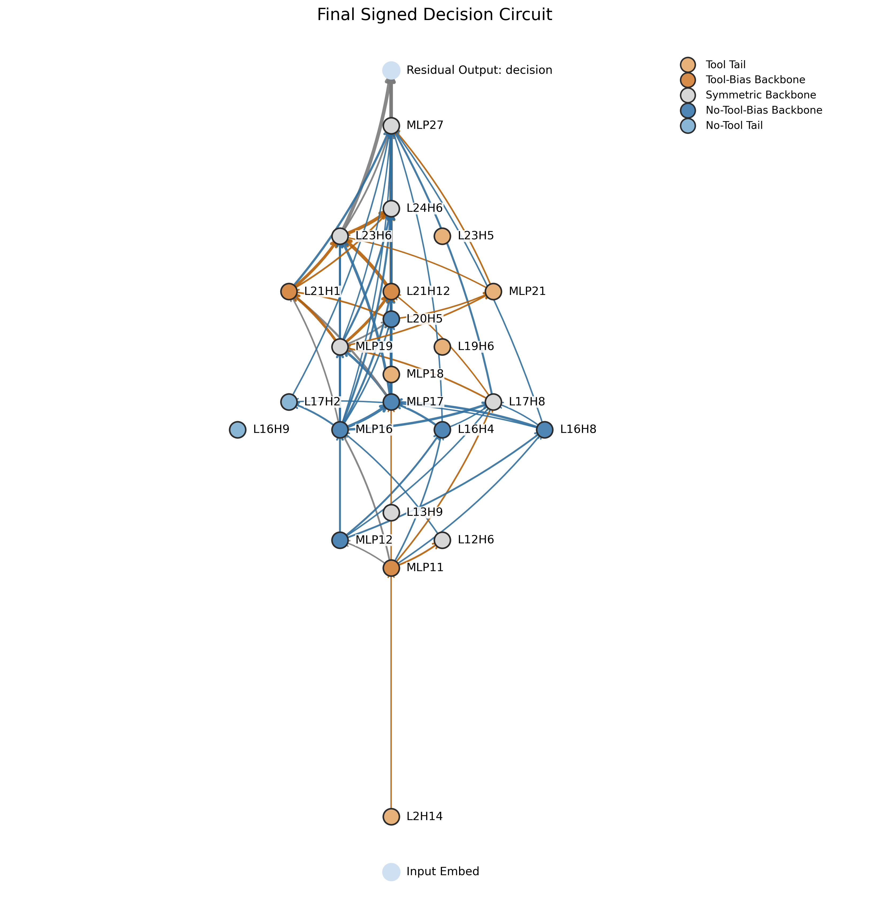
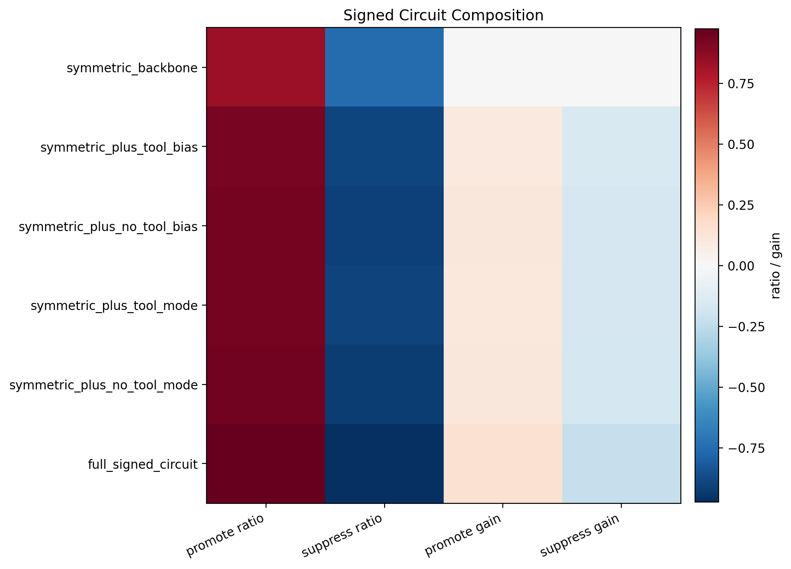

# 双向 Signed Circuit 机制报告

## 摘要

在 `Qwen3-1.7B` 的 `1189` 对 clean/corrupt 样本上，我们把原本单向的 circuit discovery 扩展成了双向的 signed decision-circuit decomposition。
最终恢复出一张 `23` 个节点、`66` 条边的 signed circuit：它不是两套独立的 promote / suppress 网络，而是一条能双向翻转行为的共享主干，再叠加写在主干内部的方向性偏置。

一句话结论是：

- 共享主干是主决策子系统，单独就能把首 token 在两个端点之间翻转。
- promote / suppress 不是两套对称独立电路，而是写在共享主干内部的方向性偏置。
- 共享主干之外确实存在尾支路，但它们弱得多，也不构成 faithful 主电路。

## 研究问题与方法

这个工作解决的问题是：单向 clean/corrupt 只能可靠地恢复促进性电路，很难把抑制性机制也放进同一张 faithful circuit 里。

我们的方法不是“跑两次得到两张图”，而是：

1. 正向把 `<tool_call>` 当作 clean，恢复推动 tool-call 的方向。
2. 反向把 no-tool 当作 clean，恢复推动 no-tool 的方向。
3. 把两个方向的共识结果分解成共享主干、tool 偏置主干、no-tool 偏置主干、以及两侧尾支路。
4. 对最终 signed circuit、语义分组、连接家族和关键节点分别做 sufficiency / necessity 验证。

因此 novelty 不在于再造一个 patch 指标，而在于把单向 circuit discovery 升级成 signed decision-circuit decomposition。

## 最终 Circuit 与语义分组

最终 signed circuit 共 `23` 个节点、`66` 条边。主图和节点/边表在：

- `final_signed_circuit/final_signed_circuit.png`
- `final_signed_circuit/final_signed_nodes.csv`
- `final_signed_circuit/final_signed_edges.csv`

- `共享主干`: `L12H6, L13H9, L17H8, MLP19, L23H6, L24H6, MLP27`
  作用: 共享主干，负责把首 token 决策稳定地推向两个竞争端点，是整张图的可翻转核心。
  代表组件: L12H6(shared router)、L13H9(shared router)、L17H8(user-content reader)、MLP19(shared writer MLP)
- `Tool 偏置主干`: `MLP11, L21H1, L21H12`
  作用: 写在共享主干内部、偏向 `<tool_call>` 端点的方向性偏置。
  代表组件: MLP11(tool-biased writer MLP)、L21H1(format/prefix router)、L21H12(format/prefix router)
- `No-Tool 偏置主干`: `MLP12, L16H4, L16H8, MLP16, MLP17, L20H5`
  作用: 写在共享主干内部、偏向 no-tool 端点的方向性偏置。
  代表组件: MLP12(no-tool-biased writer MLP)、L16H4(no-tool-biased router)、L16H8(no-tool-biased router)、MLP16(no-tool-biased writer MLP)
- `Tool 尾支路`: `L2H14, MLP18, L19H6, MLP21, L23H5`
  作用: 共享主干之外的 tool-call 弱尾支路，更像补充性放大器而不是主决策子系统。
  代表组件: L2H14(tool-tail router)、MLP18(tool-tail writer MLP)、L19H6(tool-tail router)、MLP21(tool-tail writer MLP)
- `No-Tool 尾支路`: `L16H9, L17H2`
  作用: 共享主干之外的 no-tool 弱尾支路，贡献最小。
  代表组件: L16H9(no-tool-tail router)、L17H2(no-tool-tail router)

## 核心发现

### 1. 共享主干本身就是主决策电路

- `shared_backbone` 单独就能做到 `promote top1 = 0.997`、`suppress top1 = 0.994`。
- 就算拿掉和 selective 重叠的节点，只保留 `shared_backbone_exclusive`，仍然有 `promote top1 = 0.972`、`suppress top1 = 0.969`。
- 这说明共享主干不是“公共背景电路”，而是直接承载首 token 翻转的主决策子系统。

### 2. 方向性偏置主要写在共享主干内部，而不是独立侧支

- `forward_selective` 中约 `0.696` 的支持质量落在和 shared backbone 的重叠部分；`reverse_selective` 中这一比例约 `0.886`。
- 真正独有的尾支路很弱：`forward_selective_unique` 只有 `promote/suppress top1 = 0.209/0.173`，`reverse_selective_unique` 更低到 `0.003/0.013`。
- 这意味着 promote / suppress 更像写在共享主干内部的 signed bias，而不是两套互不相干的完整电路。

### 3. 完整 circuit 和语义组都经受住了 faithfulness 验证

- 完整 `signed circuit` 的双向行为翻转率都接近饱和：`promote/suppress top1 = 0.997/0.997`。
- `共享主干` 既有高 sufficiency，又有显著 necessity：`suff = 0.833/-0.750`，`nec drop = 0.062/0.115`。
- 共享主干的端点真实性也很高：`endpoint authenticity = 0.957`，`boundary flip rate = 0.997`。
- 两类偏置主干也都不是空壳：Tool 偏置主干 `promote/suppress top1 = 0.721/0.512`，No-Tool 偏置主干是 `0.725/0.747`。
- 两侧尾支路则明显更弱：Tool 尾支路 `promote/suppress top1 = 0.209/0.173`，No-Tool 尾支路是 `0.003/0.013`。

### 4. 连接家族给出了 signed 机制的写入位置

- `tool_bias_backbone -> symmetric_backbone` 的中介效应显著：`source = 0.658`，`blocked = 0.209`，`mediated = 0.454`。
- `no_tool_bias_backbone -> symmetric_backbone` 同样显著：`source = -0.505`，`blocked = -0.145`，`mediated = -0.355`。
- 因而方向性不是凭空出现在输出层，而是通过特定 group-to-group 连接家族写入共享主干。

### 5. 关键组件锚点主要是 writer MLP，加上少数 router heads

- `MLP17` 属于 `No-Tool-Bias Backbone`，语义上更接近 `no-tool-biased writer MLP`，`promote nec = 0.027`，`suppress nec = 0.035`。
- `MLP27` 属于 `Symmetric Backbone`，语义上更接近 `shared writer MLP`，`promote nec = 0.020`，`suppress nec = 0.020`。
- `MLP11` 属于 `Tool-Bias Backbone`，语义上更接近 `tool-biased writer MLP`，`promote nec = 0.013`，`suppress nec = 0.014`。
- `MLP19` 属于 `Symmetric Backbone`，语义上更接近 `shared writer MLP`，`promote nec = 0.015`，`suppress nec = 0.012`。
- `L21H12` 属于 `Tool-Bias Backbone`，语义上更接近 `format/prefix router`，`promote nec = 0.000`，`suppress nec = 0.022`。
- `L21H1` 属于 `Tool-Bias Backbone`，语义上更接近 `format/prefix router`，`promote nec = 0.000`，`suppress nec = 0.015`。
- `MLP21` 属于 `Tool Tail`，语义上更接近 `tool-tail writer MLP`，`promote nec = 0.000`，`suppress nec = -0.013`。
- `L20H5` 属于 `No-Tool-Bias Backbone`，语义上更接近 `user-content reader`，`promote nec = 0.000`，`suppress nec = 0.013`。

## 证据链细表

### Backbone + Bias 组合验证

- `仅共享主干`: promote ratio = `0.833`，suppress ratio = `-0.750`，promote top1 = `0.972`，suppress top1 = `0.969`，promote gain vs symmetric = `0.000`，suppress gain vs symmetric = `0.000`
- `共享主干 + Tool 偏置主干`: promote ratio = `0.925`，suppress ratio = `-0.890`，promote top1 = `0.993`，suppress top1 = `0.982`，promote gain vs symmetric = `0.097`，suppress gain vs symmetric = `-0.149`
- `共享主干 + No-Tool 偏置主干`: promote ratio = `0.935`，suppress ratio = `-0.907`，promote top1 = `0.993`，suppress top1 = `0.990`，promote gain vs symmetric = `0.108`，suppress gain vs symmetric = `-0.161`
- `共享主干 + 完整 Tool 分支`: promote ratio = `0.932`，suppress ratio = `-0.904`，promote top1 = `0.996`，suppress top1 = `0.996`，promote gain vs symmetric = `0.102`，suppress gain vs symmetric = `-0.160`
- `共享主干 + 完整 No-Tool 分支`: promote ratio = `0.941`，suppress ratio = `-0.922`，promote top1 = `0.994`，suppress top1 = `0.991`，promote gain vs symmetric = `0.113`，suppress gain vs symmetric = `-0.172`
- `完整 signed circuit`: promote ratio = `0.979`，suppress ratio = `-0.967`，promote top1 = `0.997`，suppress top1 = `0.997`，promote gain vs symmetric = `0.149`，suppress gain vs symmetric = `-0.222`

这些结果支持一个更细的说法：方向性偏置确实提供增量，但这个增量主要建立在共享主干已经存在的双向可翻转能力之上。

### Signed Group 双向 Suff/Nec

- `完整电路`: promote suff = `0.979`，suppress suff = `-0.967`，promote top1 = `0.997`，suppress top1 = `0.997`，promote nec drop = `0.000`，suppress nec drop = `0.000`
- `共享主干`: promote suff = `0.833`，suppress suff = `-0.750`，promote top1 = `0.972`，suppress top1 = `0.969`，promote nec drop = `0.062`，suppress nec drop = `0.115`
- `Tool 偏置主干`: promote suff = `0.699`，suppress suff = `-0.408`，promote top1 = `0.721`，suppress top1 = `0.512`，promote nec drop = `0.028`，suppress nec drop = `0.048`
- `No-Tool 偏置主干`: promote suff = `0.710`，suppress suff = `-0.511`，promote top1 = `0.725`，suppress top1 = `0.747`，promote nec drop = `0.038`，suppress nec drop = `0.048`
- `Tool 尾支路`: promote suff = `0.500`，suppress suff = `-0.239`，promote top1 = `0.209`，suppress top1 = `0.173`，promote nec drop = `0.000`，suppress nec drop = `-0.010`
- `No-Tool 尾支路`: promote suff = `0.200`，suppress suff = `-0.085`，promote top1 = `0.003`，suppress top1 = `0.013`，promote nec drop = `0.000`，suppress nec drop = `0.004`

这一步直接验证了：整张 signed circuit 是否 faithful，各语义组是否在整张图中承担必要功能。

### 节点级 Necessity

- `MLP17` (No-Tool-Bias Backbone / no-tool-biased writer MLP): promote nec = `0.027`，suppress nec = `0.035`，promote suff = `0.350`，suppress suff = `-0.208`
- `MLP27` (Symmetric Backbone / shared writer MLP): promote nec = `0.020`，suppress nec = `0.020`，promote suff = `0.536`，suppress suff = `-0.409`
- `MLP11` (Tool-Bias Backbone / tool-biased writer MLP): promote nec = `0.013`，suppress nec = `0.014`，promote suff = `0.213`，suppress suff = `-0.070`
- `MLP19` (Symmetric Backbone / shared writer MLP): promote nec = `0.015`，suppress nec = `0.012`，promote suff = `0.340`，suppress suff = `-0.152`
- `L21H12` (Tool-Bias Backbone / format/prefix router): promote nec = `0.000`，suppress nec = `0.022`，promote suff = `0.434`，suppress suff = `-0.145`
- `L21H1` (Tool-Bias Backbone / format/prefix router): promote nec = `0.000`，suppress nec = `0.015`，promote suff = `0.362`，suppress suff = `-0.114`
- `MLP21` (Tool Tail / tool-tail writer MLP): promote nec = `0.000`，suppress nec = `-0.013`，promote suff = `0.236`，suppress suff = `-0.048`
- `L20H5` (No-Tool-Bias Backbone / user-content reader): promote nec = `0.000`，suppress nec = `0.013`，promote suff = `0.183`，suppress suff = `-0.079`
- `L23H6` (Symmetric Backbone / shared router): promote nec = `0.000`，suppress nec = `0.002`，promote suff = `0.327`，suppress suff = `-0.122`
- `MLP16` (No-Tool-Bias Backbone / no-tool-biased writer MLP): promote nec = `0.000`，suppress nec = `0.000`，promote suff = `0.331`，suppress suff = `-0.195`

这一步把 faithfulness 压到组件层级，说明哪些具体节点是 backbone 的关键承载点，哪些只是弱尾支路。

### Layer-wise Margin Trajectory

- `no_tool_base`: early = `-45.500`，mid = `-8.500`，late = `-5.000`
- `no_tool_plus_symmetric`: early = `-45.500`，mid = `-8.500`，late = `2.000`
- `no_tool_plus_tool_bias`: early = `-45.500`，mid = `-8.344`，late = `2.625`
- `tool_base`: early = `-45.500`，mid = `-8.438`，late = `3.375`
- `tool_plus_symmetric`: early = `-45.500`，mid = `-8.500`，late = `-3.000`
- `tool_plus_no_tool_bias`: early = `-45.500`，mid = `-8.438`，late = `-4.250`

这张图对应常见的 logit-lens / margin 轨迹表达，说明 shared backbone 在深层把决策拉向边界，而方向性 bias 继续把边界推向各自端点。

## 图表与文件

- 主电路图: `final_signed_circuit/final_signed_circuit.png`
- 组级 suff/nec 热图: `signed_validate_full/signed_group_validation_heatmap.png`
- 连接家族图: `final_signed_families/signed_family_graph.png`
- 组合验证热图: `signed_composition_full/signed_composition_heatmap.png`
- 节点重要性热图: `signed_node_importance_200/signed_node_importance_heatmap.png`
- 层间 margin 轨迹图: `signed_layer_trajectory_200/signed_layer_trajectory.png`

## 局限与下一步

- 现在最强的结论已经到达 `group` 和 `node` 层级；如果要继续提高说服力，下一步最值钱的是对最终图里的关键边做 leave-one-edge-out necessity。
- 目前所有结果都聚焦在“首 token 是否为 `<tool_call>`”这个决策点；如果要更进一步，可以把同一 signed method 扩展到更长的生成轨迹。
- 但就当前任务来说，这份结果已经足够支撑一个明确的方法论故事：双向运行恢复的不是两张图，而是一张 faithful 的 signed circuit。

## 方法论

可以把这套方法概括成一句话：

`Bidirectional Decision-Circuit Decomposition = 双向端点恢复 + signed 分解 + 语义分组 + 多层 faithfulness 验证。`

如果把它写成论文式贡献点，就是：

1. 提出一种从双向 clean/corrupt 中恢复 signed decision circuit 的方法。
2. 在 tool-call / no-tool 任务上恢复出一张具有清晰语义分组的 faithful circuit。
3. 用行为翻转、suff/nec、连接中介和节点必要性证明：真实机制更像共享主干上的方向性偏置，而不是两套独立 promote / suppress 网络。
