# Tool-Call Circuit Final Package

## 1. 交付说明

这个目录是当前项目的最终整理版交付包。根目录只保留一个 `final` 目录，里面包含：

- `FINAL_PACKAGE.md`：最终总文档。
- `figures/`：顺序编号后的图像，命名为 `figure_01` 到最后一张。
- `data/`：关键汇总表、关键 JSON、节点与边的证据表。
- `archive/`：旧 run 和旧结果归档，避免 `results` 根目录继续混乱。

本文档优先回答四个问题：

1. 模型在首个生成位置如何决定输出 `<tool_call>` 还是 `no_tool`。
2. 这条机制链包含哪些节点，它们各自读什么、写什么、通过什么路径起作用。
3. 完整 24 节点电路如何和 8 节点核心决策链对应。
4. 所有图和指标各自是什么意思，应该如何解释。

## 2. 最终机制摘要

当前最强的机制结论是：

1. 模型首先从用户第一句 instruction 中读取一个 **instruction-level commitment cue**。这个 cue 区分的是“要求把结果交付到外部文件/环境里”还是“仅要求把函数体写出来”。
2. 这个 cue 通过晚层 user-conditioned ingress 路径 `L20H5 -> L21H1/L21H12 -> L24H6 -> MLP27` 进入 tool-call 写出链。
3. `MLP27` 是主要的晚层 writer，它把这条状态写成 `<tool_call>` 倾向。
4. 同时存在一条竞争性的 no-tool 链 `L16H4 -> MLP17 -> L23H6`，它会把相同工具环境下的请求压回 `no_tool`，并且会压制 tool ingress。

最核心的整体验证指标如下：

- 数据规模：`1722` 对 clean/corrupt 样本。
- 最终 signed circuit：`24` 个节点，`64` 条边。
- full-circuit KL recovery：promote `1.000`，suppress `0.998`。
- full-circuit top-1 保真：promote `0.999`，suppress `0.997`。
- 固定 schema 下的完整 tool 主链 top-1：`0.937`。
- 完整 no-tool 竞争链 top-1：`0.516`。
- 只换整句 instruction 后的 no-tool top-1：`0.999`。
- 只换首句 lead phrase 后的 no-tool top-1：`0.999`。

## 3. 先讲完整 24 节点电路，再讲 8 节点核心链

这次最终 signed circuit 不是一条单线，而是一个 `24` 节点 / `64` 边的有向电路。理解它时要分两层：

- **完整 24 节点电路**：负责提供上下文、维持 tool/no-tool 两条候选通路、并在晚层汇合。
- **8 节点核心链**：负责最终把决策写到首个生成位置。

当前最合理的全电路分层是：

- 早期 query 入口候选：`L2H14, MLP11`
- 共享整合骨架：`L12H6, L13H9, MLP16, MLP19`
- 工具侧辅助读取/路由：`L16H8, L17H2, L17H8, L23H5, MLP21`
- no-tool 侧辅助抑制链：`MLP12, L15H5, L16H13, L16H9, L18H14`
- 最终决策核心：`L16H4, MLP17, L20H5, L21H1, L21H12, L23H6, L24H6, MLP27`

其中真正可以进入主文核心算法的，是这条 8 节点最小主链：

- tool 决策主链：`L20H5 -> L21H1/L21H12 -> L24H6 -> MLP27`
- no-tool 竞争主链：`L16H4 -> MLP17 -> L23H6`

## 4. 结构组与功能组

### 4.1 结构组

| 结构组 | 节点数 | promote sufficiency | suppress sufficiency | 作用 |
|---|---:|---:|---:|---|
| full_signed_circuit | 24 | 1.000 | 0.998 | full_signed_circuit 在结构层上的保真度与抑制能力。 |
| Symmetric Backbone | 8 | 0.994 | 0.986 | Symmetric Backbone 在结构层上的保真度与抑制能力。 |
| Tool-Bias Backbone | 4 | 0.965 | 0.865 | Tool-Bias Backbone 在结构层上的保真度与抑制能力。 |
| No-Tool-Bias Backbone | 4 | 0.892 | 0.799 | No-Tool-Bias Backbone 在结构层上的保真度与抑制能力。 |
| Tool Tail | 4 | 0.690 | 0.407 | Tool Tail 在结构层上的保真度与抑制能力。 |
| No-Tool Tail | 4 | 0.479 | 0.353 | No-Tool Tail 在结构层上的保真度与抑制能力。 |

### 4.2 功能组

| 功能组 | 节点 | promote median | suppress median | 解释 |
|---|---|---:|---:|---|
| Tool-Schema Readers | L16H8,L17H2,L17H8,L21H1,L21H12,L23H5 | 0.318 | 0.214 | heads that read tool schema or tool-call tag structure and favor the tool endpoint |
| User-Query Readers | L2H14 | 0.042 | 0.006 | heads that read user content while still promoting tool-use execution |
| Suppression Readers | L15H5,L16H13,L16H4,L16H9,L18H14,L23H6 | 0.259 | 0.117 | heads that read user/prefix evidence and tilt the system toward no-tool mode |
| Tool-Call Writers | MLP11,MLP21 | 0.405 | 0.153 | writer nodes whose causal profile is strongest for the tool-call endpoint |
| No-Tool Writers | MLP12,MLP17 | 0.554 | 0.474 | writer nodes whose causal profile is strongest for the no-tool endpoint |
| Arbitration Integrators | L12H6,L13H9,MLP16,MLP19,L20H5,L24H6,MLP27 | 0.524 | 0.376 | shared late-stage nodes that integrate competing evidence and stabilize the decision boundary |

结构组回答“节点在电路图上的拓扑位置”，功能组回答“节点在对象语言上更像在做什么”。两者不能混用：

- 结构组保留了全 24 节点电路的整体形状。
- 功能组帮助把 attention head 和 MLP 串成人类可理解的步骤。

## 5. 8 个核心节点的对象语言机制与证据

| 节点 | 对象语言功能 | 读什么 | 写什么 | 关键证据 |
|---|---|---|---|---|
| L20H5 | late user-conditioned ingress point | instruction-level commitment cue | early tool-biased state that can be routed downstream | rescue `0.308`, top1 `0.005`; `L20H5->L21H12` mediation `0.094`; `L20H5->L21H1` `0.052`; best QKV component `z` rescue `0.308`; instruction swap flips to tool-top1 `1.000`; lead swap flips to tool-top1 `1.000` |
| L21H1 | late query router | mixed user-side / instruction-conditioned state | tool-biased routed state | rescue `0.573`, top1 `0.056`; `L21H1->MLP27` mediation `0.292`; best QKV component `z` rescue `0.573`; instruction swap flips to tool-top1 `1.000`; lead swap flips to tool-top1 `1.000` |
| L21H12 | late commitment/schema router | instruction-conditioned late state plus tool-call channel state | tool-biased routed state into MLP27 | rescue `0.707`, top1 `0.159`; `L21H12->MLP27` mediation `0.328`; best QKV component `z` rescue `0.707`; instruction swap flips to tool-top1 `1.000`; lead swap flips to tool-top1 `1.000` |
| L24H6 | late pre-writer relay | late tool-biased routed state | tool-biased pre-output state | rescue `0.574`, top1 `0.005`; full query route reaches tool-top1 `0.857` before MLP27; best QKV component `z` rescue `0.574`; instruction swap flips to tool-top1 `1.000`; lead swap flips to tool-top1 `1.000` |
| MLP27 | primary late writer | late commitment-conditioned tool state | <tool_call>-favoring residual direction | rescue `0.809`, top1 `0.289`; steering `corrupt_full` tool-top1 `0.833`; backup search best independent alt `L21H12`=`0.371`; instruction swap flips to tool-top1 `1.000`; lead swap flips to tool-top1 `1.000` |
| L16H4 | no-tool-biased user-side reader | user-side no-tool-biased state | suppression route state | rescue `0.198`, top1 `0.012`; `L16H4->MLP17` mediation `0.422`; best QKV component `z` rescue `0.198`; clean-with-corrupt-instruction flips to no-tool-top1 `0.999` |
| MLP17 | no-tool writer | no-tool-biased user-side state | no_tool-favoring residual direction | rescue `0.474`, top1 `0.153`; `MLP17->L23H6` mediation `0.192`; `MLP17->L20H5` mediation `0.049`; clean-with-corrupt-instruction flips to no-tool-top1 `0.999` |
| L23H6 | late suppressive relay | no-tool written state | late suppressive state | rescue `0.280`, top1 `0.022`; `MLP17->L23H6` mediation `0.192`; best QKV component `z` rescue `0.280`; clean-with-corrupt-instruction flips to no-tool-top1 `0.999` |

### 5.1 这 8 个节点怎样协作

- `L20H5` 把 instruction-level commitment cue 接入晚层 tool 路。
- `L21H1` 和 `L21H12` 负责把这条状态继续路由，其中 `L21H12 -> MLP27` 是更强主路。
- `L24H6` 位于 writer 之前，更像 pre-writer relay。
- `MLP27` 负责把这条状态写成 `<tool_call>` 倾向。
- `L16H4 -> MLP17 -> L23H6` 则构成 competing no-tool chain。
- `MLP17` 不只是写 `no_tool`，还会压 `L20H5 / L21H1 / L21H12` 这些 tool ingress 点。

## 6. 完整 24 节点清单

下表保留了全 24 个节点的当前语义和证据摘要。它回答的是“全电路里每个节点目前被解释成什么”，而不是“所有节点都已经达到相同强度的 mechanistic certainty”。

| 节点 | 层 | 结构组 | 功能组 | 当前语义提示 | 当前证据摘要 |
|---|---:|---|---|---|---|
| L16H8 | 16 | no_tool_bias_backbone | Tool-Schema Readers | no-tool-biased router | reads tools/tags (tools=0.29, tags=0.002) |
| L17H2 | 17 | no_tool_tail | Tool-Schema Readers | no-tool-tail router | reads tools/tags (tools=0.15, tags=0.019) |
| L17H8 | 17 | symmetric_backbone | Tool-Schema Readers | shared router | reads tools/tags (tools=0.27, tags=0.012) |
| L21H1 | 21 | tool_bias_backbone | Tool-Schema Readers | format/prefix router | reads tools/tags (tools=0.11, tags=0.025) |
| L21H12 | 21 | tool_bias_backbone | Tool-Schema Readers | format/prefix router | reads tools/tags (tools=0.25, tags=0.015) |
| L23H5 | 23 | tool_tail | Tool-Schema Readers | format/prefix router | reads tools/tags (tools=0.13, tags=0.266) |
| L2H14 | 2 | tool_tail | User-Query Readers | tool-tail router | reads user content on tool endpoint (user=0.31) |
| L15H5 | 15 | no_tool_tail | Suppression Readers | no-tool-tail router | reads user/prefix more in no-tool mode (d_user=+0.03, d_prefix=+0.00) |
| L16H13 | 16 | no_tool_tail | Suppression Readers | no-tool-tail router | reads user/prefix more in no-tool mode (d_user=+0.06, d_prefix=-0.01) |
| L16H4 | 16 | no_tool_bias_backbone | Suppression Readers | no-tool-biased router | reads user/prefix more in no-tool mode (d_user=+0.06, d_prefix=-0.00) |
| L16H9 | 16 | no_tool_tail | Suppression Readers | no-tool-tail router | reads user/prefix more in no-tool mode (d_user=+0.03, d_prefix=-0.01) |
| L18H14 | 18 | tool_tail | Suppression Readers | format/prefix router | reads user/prefix more in no-tool mode (d_user=+0.01, d_prefix=+0.08) |
| L23H6 | 23 | tool_bias_backbone | Suppression Readers | tool-biased router | reads user/prefix more in no-tool mode (d_user=+0.02, d_prefix=+0.06) |
| MLP11 | 11 | tool_bias_backbone | Tool-Call Writers | tool-biased writer MLP | tool-skewed writer (+0.18) |
| MLP21 | 21 | tool_tail | Tool-Call Writers | tool-tail writer MLP | tool-skewed writer (+0.26) |
| MLP12 | 12 | no_tool_bias_backbone | No-Tool Writers | no-tool-biased writer MLP | no-tool-skewed writer (+0.03) |
| MLP17 | 17 | no_tool_bias_backbone | No-Tool Writers | no-tool-biased writer MLP | no-tool-skewed writer (+0.08) |
| L12H6 | 12 | symmetric_backbone | Arbitration Integrators | shared router | balanced router (+0.07) |
| L13H9 | 13 | symmetric_backbone | Arbitration Integrators | shared router | balanced router (+0.03) |
| MLP16 | 16 | symmetric_backbone | Arbitration Integrators | shared writer MLP | shared late writer with balanced causal role (+0.09) |
| MLP19 | 19 | symmetric_backbone | Arbitration Integrators | shared writer MLP | shared late writer with balanced causal role (+0.16) |
| L20H5 | 20 | symmetric_backbone | Arbitration Integrators | user-content reader | late shared head with balanced causal profile (+0.11) |
| L24H6 | 24 | symmetric_backbone | Arbitration Integrators | format/prefix router | late shared head with balanced causal profile (+0.16) |
| MLP27 | 27 | symmetric_backbone | Arbitration Integrators | shared writer MLP | shared late writer with balanced causal role (+0.00) |

## 7. 公式、指标与符号解释

### 7.1 两个 endpoint 分布

我们在首个生成位置上定义两个 clean endpoint 分布：

- `p^clean_tool`：clean prompt 在 `<tool_call>` 端点附近的分布。
- `p^clean_no_tool`：clean no-tool endpoint 在 `no_tool` 端点附近的分布。

设某个变体、patch 或 intervention 后的首 token 分布为 `q`。

### 7.2 两个 KL 目标分数

工具目标分数定义为：

`S_tool(q) = - KL(p^clean_tool || q)`

no-tool 目标分数定义为：

`S_no_tool(q) = - KL(p^clean_no_tool || q)`

解释：

- `KL(· || ·)` 越小，表示当前分布 `q` 越接近目标 endpoint 分布。
- 前面加负号，是为了让“越接近目标”对应“分数越大”。
- 所以 `S_tool` 越大，说明当前状态越像 clean 的 `<tool_call>` endpoint。
- `S_no_tool` 越大，说明当前状态越像 clean 的 `no_tool` endpoint。

### 7.3 决策分数

最终我们用：

`DecisionScore(q) = S_tool(q) - S_no_tool(q)`

来刻画首 token 更偏向哪一边。

解释：

- `DecisionScore > 0`：更偏 `<tool_call>`。
- `DecisionScore < 0`：更偏 `no_tool`。
- 它比单看某一个 logit 更稳，因为它同时比较了两个 endpoint。

### 7.4 Rescue Ratio

当我们从 base 状态 patch 一组节点到 anchor 状态时，恢复比例定义为：

`RescueRatio = (Score_patched - Score_base) / (Score_anchor - Score_base)`

解释：

- `Score_base`：没有 patch 时的分数。
- `Score_anchor`：目标端点的分数。
- `Score_patched`：patch 后的分数。
- `RescueRatio = 1` 表示完全恢复到 anchor 水平。
- `RescueRatio = 0` 表示没有救回。
- `RescueRatio < 0` 表示 patch 方向错了，反而更远。

### 7.5 Mediation Ratio

对边 `A -> B`，我们用：

`Mediation(A -> B) = Rescue(source-only) - Rescue(source-with-B-blocked)`

来估计这条边真正承担了多少因果传递。

解释：

- 如果 source-only rescue 很高，而把 `B` 挡住后 rescue 明显下降，说明 `A` 很大一部分效应是经由 `B` 实现的。
- Mediation 值越大，说明这条边越像真正的因果通路。

### 7.6 Top-1 Rate 与 Boundary Flip Rate

- `tool_top1_rate`：patch 后首 token 直接变成 `<tool_call>` 的样本比例。
- `no_tool_top1_rate`：patch 后首 token 直接变成 `no_tool` 的样本比例。
- `boundary_flip_rate`：`DecisionScore` 是否跨过 0 的比例。

解释：

- `DecisionScore` 看的是分布级别的方向变化。
- `top1_rate` 看的是最终离散决策是否真的翻转。
- 两者结合起来，既能看软分数变化，也能看硬决策变化。

## 8. 反向发现和 no-tool 支路

这部分很关键。当前 `no_tool` 语义线并不是后验随便命名出来的，而是和双向发现中的 reverse 方向高度重合。

- 最小 no-tool 主链 `L16H4 -> MLP17 -> L23H6` 被 reverse core 完整包含。
- 扩展后的 reverse-aligned no-tool 语义线 `MLP12, L15H5, L16H13, L16H4, L16H8, L16H9, MLP17, L17H2, L23H6`：
  - 节点上命中全部 `8/8` 个 reverse-selective 节点，额外只多一个共享晚层节点 `L23H6`
  - 节点 Jaccard 为 `0.889`
  - 边 Jaccard 为 `0.824`

这说明：

- forward 方向更容易暴露促进 `<tool_call>` 的节点。
- reverse 方向特别有利于暴露 suppressive / no-tool-biased 节点。
- 双向方法本身就在帮助我们同时看见“促进支路”和“抑制支路”。

## 9. 图像总览与逐图解释

下面的图全部已经复制到 `figures/`，并按 `figure_01` 到最后一张的顺序重命名。每一张图都给出“怎么看”和“它支持什么结论”。

## 图01 最终 Signed Circuit 总览

**怎么看这张图**：节点表示最终保留下来的 24 个电路节点，边表示最终保留下来的 64 条边。颜色表示结构层上的偏向或共享性。

**这张图支持的结论**：这张图证明最终交付不是零散节点，而是一张稀疏但完整的 signed circuit。

## 图02 24 节点功能语义分组图

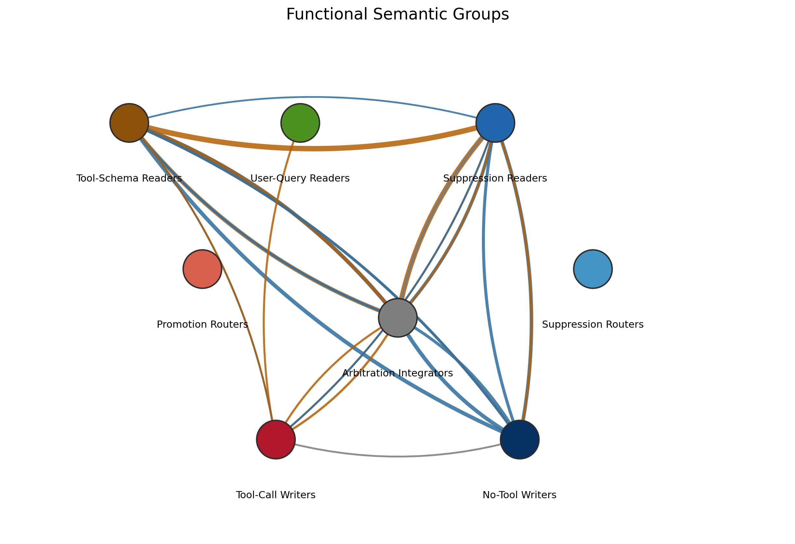

**怎么看这张图**：同一张电路按功能组重新上色，显示 tool-schema readers、suppression readers、writers、integrators 等组。

**这张图支持的结论**：这张图把 24 个节点从结构图变成可叙述的功能图，是后续机制故事的桥梁。

## 图03 双向发现后的联合电路

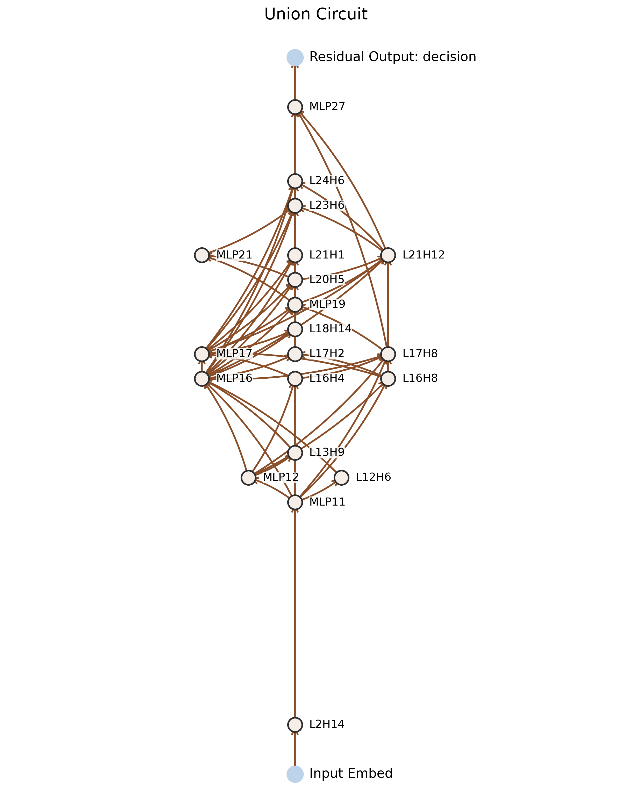

**怎么看这张图**：这张图展示 forward 与 reverse 两个方向联合后的节点和边。

**这张图支持的结论**：它说明最终 signed circuit 来自双向发现，而不是单向启发式筛选。

## 图04 Reverse-Selective 子电路

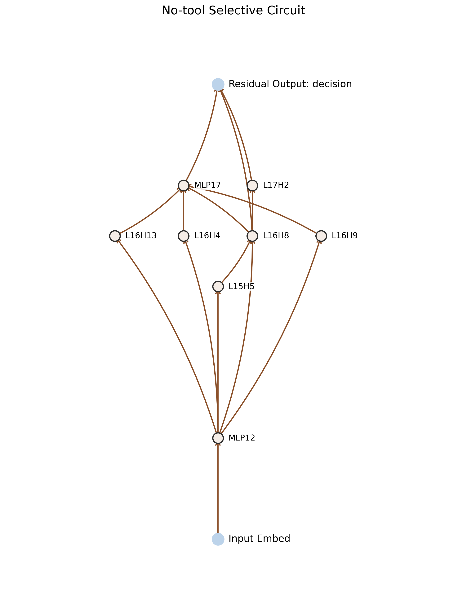

**怎么看这张图**：这张图只保留 reverse-selective 支路，主要是 no-tool / suppressive 方向。

**这张图支持的结论**：它直接支持“反向发现特别有利于暴露抑制节点和抑制支路”。

## 图05 结构组保真验证热图

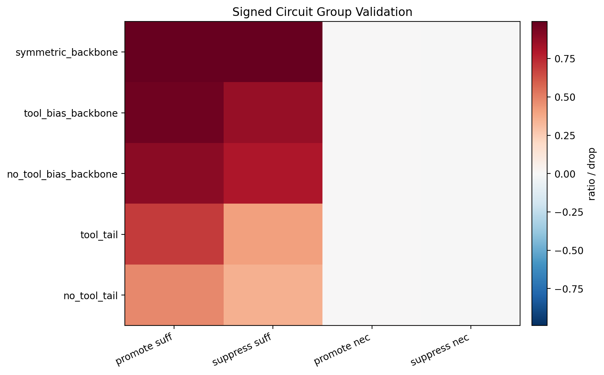

**怎么看这张图**：热图显示不同结构组在 promote/suppress 两个方向上的 sufficiency 与 necessity。

**这张图支持的结论**：它证明完整电路和主要结构组在行为层面是 faithful 的，不是纯相关图。

## 图06 功能组保真验证热图

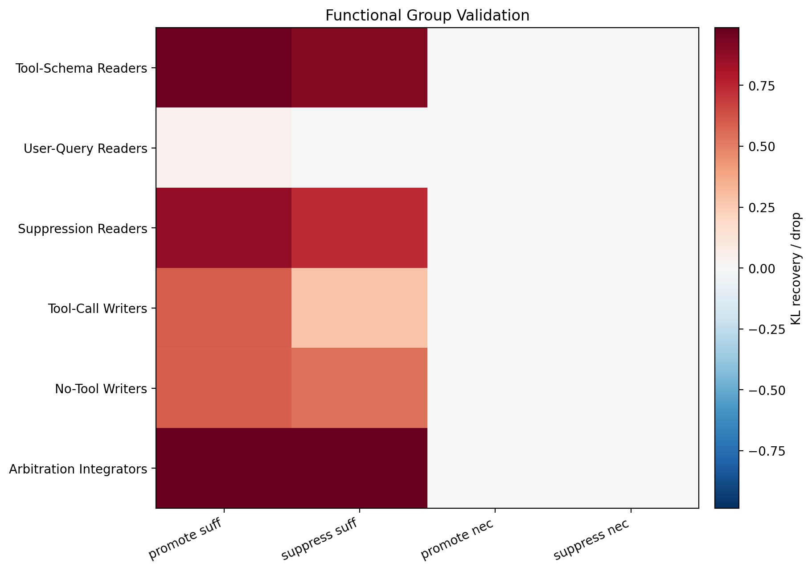

**怎么看这张图**：热图显示功能组在 tool/no-tool 两个方向上的 sufficiency 与 necessity。

**这张图支持的结论**：它说明语义分组不是只看 attention 命名，而是有行为恢复支撑。

## 图07 固定 Schema 下的 Query 决策链逐步恢复

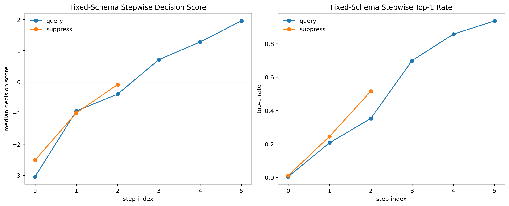

**怎么看这张图**：横轴是逐步加入的节点集合，纵轴分别看 decision score 和 top-1 恢复率。

**这张图支持的结论**：它证明在固定工具环境下，`L20H5 -> L21H1/L21H12 -> L24H6 -> MLP27` 会逐步把 corrupt 拉回 `<tool_call>`。

## 图08 整句 Instruction Swap 的行为翻转

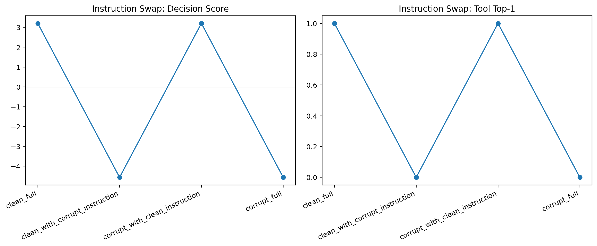

**怎么看这张图**：左图是 decision score，右图是 `<tool_call>`/`no_tool` top-1 比例。

**这张图支持的结论**：它证明第一句 instruction 本身就是强决定变量。

## 图09 最小 Lead Phrase Swap 的行为翻转

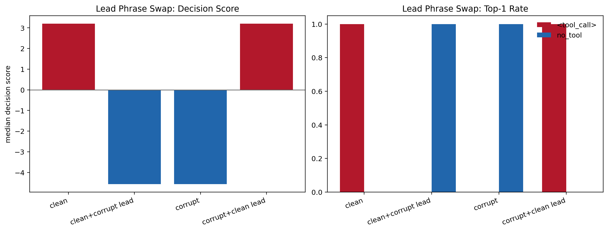

**怎么看这张图**：只换首句开头短语，不换后面主体内容，仍然看 decision score 和 top-1。

**这张图支持的结论**：它把关键变量继续缩小到 instruction 开头的 commitment cue，而不是整段文本。

## 图10 MLP27 局部写出干预曲线

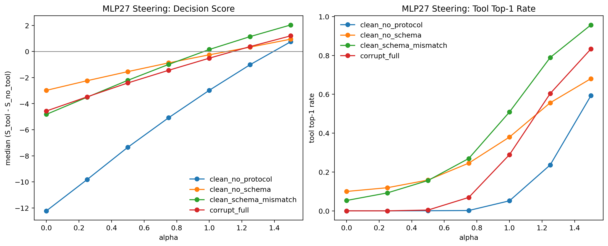

**怎么看这张图**：不同 alpha 表示对 MLP27 局部表示的不同强度 steering，纵轴看 decision score 与 top-1。

**这张图支持的结论**：这张图支持 `MLP27` 是主要晚层 writer，而不只是一个相关晚层节点。

## 图11 关键 Attention Head 的 Span 读取密度

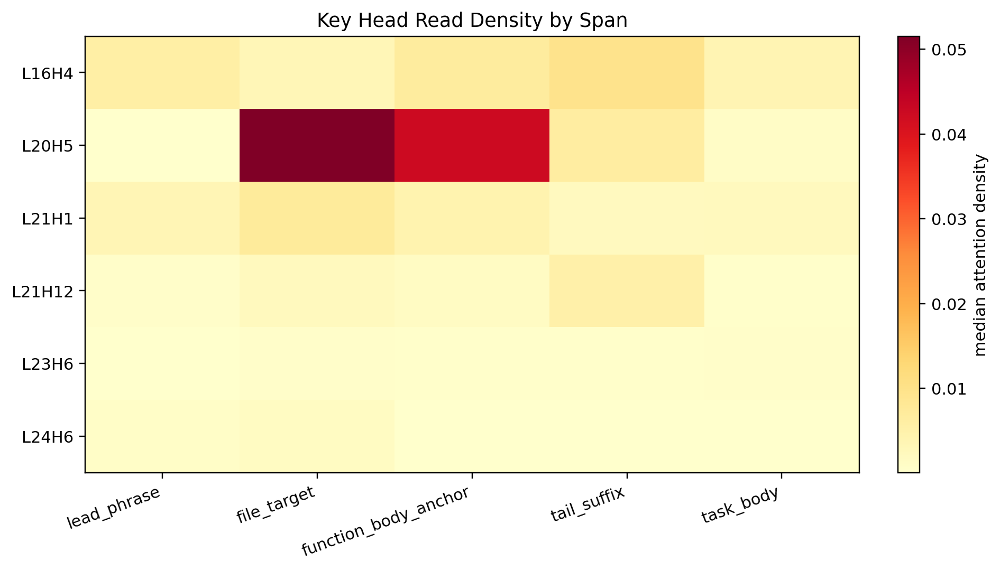

**怎么看这张图**：横轴是候选 span，纵轴是关键 head，颜色越深表示中位 attention density 越高。

**这张图支持的结论**：它帮助判断 head 更像在读 lead phrase、file target、function body scaffold 还是 task body。

## 图12 关键 Attention Head 的 Q/K/V/Z 分解

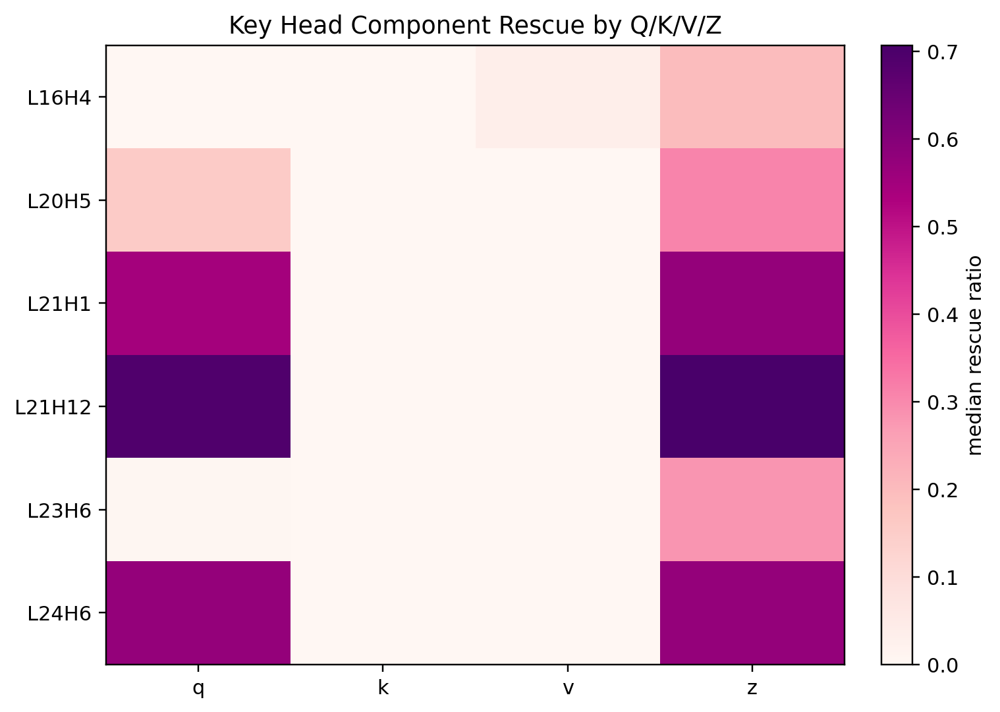

**怎么看这张图**：颜色表示把某个组件单独 patch 回去后带来的 rescue ratio。

**这张图支持的结论**：它说明 tool 路上的关键 head 更像 late routing head，主要依赖 Q/Z，而不是纯 V-copy。

## 图13 No-Tool 语义线与 Reverse Discovery 的重合

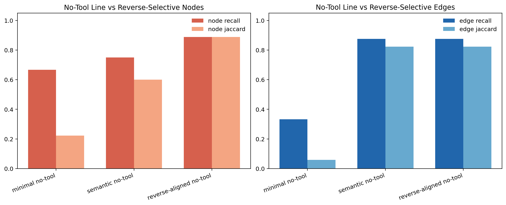

**怎么看这张图**：左图比较节点重合，右图比较边重合；越接近 1 表示越一致。

**这张图支持的结论**：它证明 no-tool 语义线与 reverse-selective 子电路高度重合。

## 图14 边级中介热图

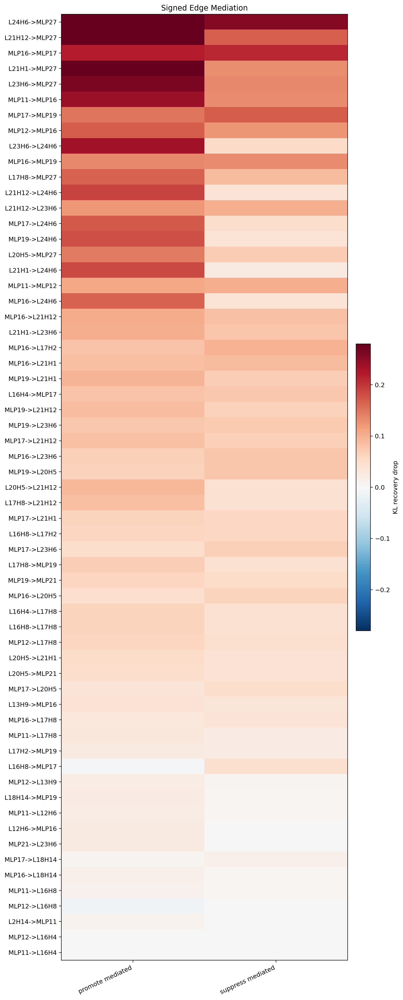

**怎么看这张图**：热图颜色表示边的中介强度，越高表示越像真正的因果通路。

**这张图支持的结论**：它支持 `L21H12 -> MLP27` 和 `L16H4 -> MLP17 -> L23H6` 不是单纯共现边。

## 图15 早期语义链提取的渐进恢复

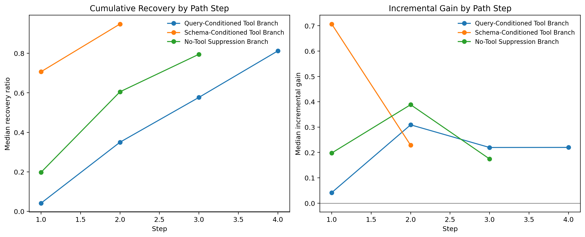

**怎么看这张图**：这张图展示最早一轮 semantic chain 提取时，逐步加入节点后的恢复曲线。

**这张图支持的结论**：它展示了从早期 chain 候选到后来 fixed-schema 主链的演进关系。

## 图16 Schema / Protocol 两步恢复图

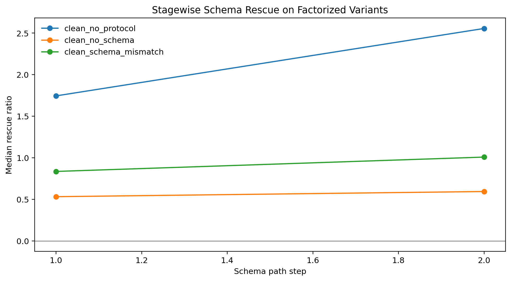

**怎么看这张图**：第一步看 `L21H12`，第二步看 `MLP27`，观察在 no-schema/no-protocol 等变体上的恢复。

**这张图支持的结论**：它说明 `L21H12` 与 `MLP27` 分别承担 late routing 和 late writing 的不同角色。

## 图17 跨层决策轨迹图

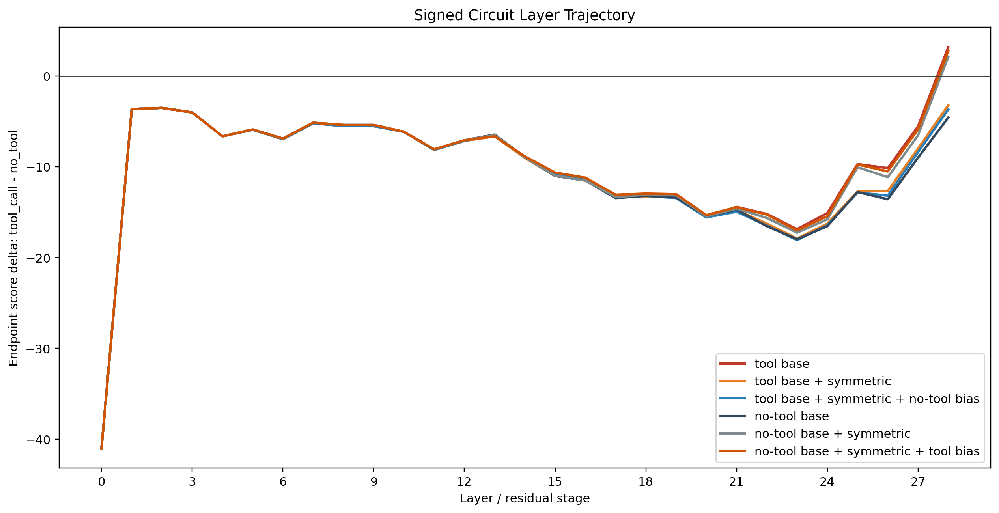

**怎么看这张图**：横轴是层号，纵轴是不同方向上累积的 signed effect。

**这张图支持的结论**：它说明最终决策是如何在中晚层逐渐成形，而不是单层瞬时出现。

## 10. 数据文件索引

- `data/summary_metrics.json`：关键总指标。
- `data/final_signed_circuit_summary.json`：24 节点 / 64 边的结构总表。
- `data/final_signed_nodes.csv`：节点清单。
- `data/final_signed_edges.csv`：边清单。
- `data/functional_group_summary.json`：功能组总表。
- `data/functional_node_table.csv`：24 节点功能归类。
- `data/signed_group_report.json`：结构保真验证。
- `data/functional_group_report.json`：功能组保真验证。
- `data/query_decision_summary.json`：固定 schema 下的主链/竞争链结果。
- `data/instruction_commitment_summary.json`：整句 instruction 交换结果。
- `data/instruction_lead_summary.json`：lead phrase 交换结果。
- `data/mlp27_steering_summary.json`：`MLP27` 局部写出干预结果。
- `data/late_writer_backup_summary.json`：`MLP27` backup/minimality 结果。
- `data/head_final_audit_summary.json`：attention head 终版审计。
- `data/head_span_attention_summary.csv`：head 的 span 读取密度。
- `data/head_qkv_patch_summary.csv`：head 的 Q/K/V/Z rescue。
- `data/final_component_evidence_table.csv`：核心节点证据表。
- `data/final_edge_evidence_table.csv`：核心边证据表。
- `data/final_claim_tree.json`：主张分级。
- `data/reverse_overlap_summary.json`：no-tool 线和 reverse discovery 的重合分析。

## 11. 写作边界

当前可以强写的，是：

- 在固定工具环境里，instruction-level commitment cue 足以驱动 `<tool_call>` / `no_tool` 的翻转。
- 这条 cue 通过 `L20H5 -> L21H1/L21H12 -> L24H6 -> MLP27` 进入 tool-call 写出链。
- `MLP27` 是主要晚层 writer。
- `L16H4 -> MLP17 -> L23H6` 是竞争性的 no-tool 链。
- reverse discovery 对 suppressive / no-tool 支路特别敏感。

当前必须弱写的，是：

- `L20H5` 是否已经是完全抽象的 action-demand reader。
- `L16H4` 是否已经是完全纯净的 ordinary-answer prior reader。
- `direct-answer sufficiency` 是否就是当前数据里唯一的潜变量。

当前不能再写的，是：

- “统一模式切换器”
- “抽象仲裁区”
- “所有 reverse 节点都等于抑制节点”
- “所有 24 个节点都已经达到同等强度的语义确定性”
